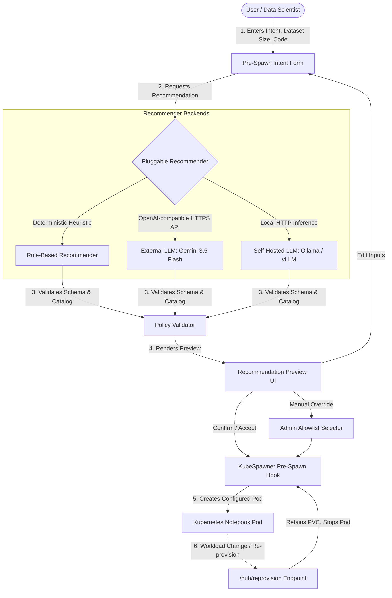

# Intent- and Context-Aware Profile Recommendation for Zero to JupyterHub

This repository contains the graduation thesis prototype and research artifact:

> **Intent- and Context-Aware Profile Recommendation for Zero to JupyterHub and KubeSpawner**

Instead of forcing users to guess raw hardware quantities (CPU/RAM limits), the system asks users to describe their workload intent, accepts optional dataset sizes and code context, and presents an explainable recommendation preview combining an optimal resource profile and an administrator-allowlisted notebook image. Users can confirm, edit, or override the recommendation before any Kubernetes pod is created.

---

## Table of Contents

1. [Problem Statement](#problem-statement)
2. [Core System Architecture & Features](#core-system-architecture--features)
   - [Interactive Recommendation & Preview UI](#interactive-recommendation--preview-ui)
   - [Curated Notebook Container Image Matching](#curated-notebook-container-image-matching)
   - [Pluggable Recommender Engine](#pluggable-recommender-engine)
     - [Rule-Based Recommender](#1-rule-based-recommender)
     - [External LLM API (e.g., Google Gemini)](#2-external-llm-api-eg-google-gemini)
     - [Self-Hosted LLM (e.g., Local Ollama)](#3-self-hosted-llm-eg-local-ollama)
   - [Storage-Preserving Notebook Re-Provisioning](#storage-preserving-notebook-re-provisioning)
   - [Policy-Bounded Dynamic Resource Sizing](#policy-bounded-dynamic-resource-sizing)
   - [Evaluation Protocol v4 & Benchmarking Suite](#evaluation-protocol-v4--benchmarking-suite)
3. [Setup & Deployment Guide](#setup--deployment-guide)
   - [Prerequisites & Local Verification](#1-prerequisites--local-verification)
   - [Deploying the Interactive Demo](#2-deploying-the-interactive-demo)
   - [Configuring External LLM (Gemini API)](#3-configuring-external-llm-gemini-api)
   - [Configuring Self-Hosted LLM (Local Ollama)](#4-configuring-self-hosted-llm-local-ollama)
   - [Enabling Dynamic Resource Selection](#5-enabling-dynamic-resource-selection)
4. [Repository Map](#repository-map)
5. [Verification & Test Commands](#verification--test-commands)
6. [Research Scope, Limitations & Data Safety](#research-scope-limitations--data-safety)
7. [Cleanup](#cleanup)
8. [Documentation Index](#documentation-index)

---

## Problem Statement

Conventional JupyterHub deployments ask users to pick from static profiles such as **Small**, **Medium**, or **Large**. Data scientists and students understand their task (e.g., training a scikit-learn model, exploring a CSV, or building deep networks), but often lack Kubernetes infrastructure intuition.

This mismatch causes three major platform inefficiencies:

* **Underprovisioning**: A user chooses Small for a data-intensive workload; the notebook runs briefly and then crashes with an Out-Of-Memory (OOM) error, losing unsaved progress.
* **Overprovisioning**: An idle or lightweight session reserves high CPU/RAM, reducing cluster schedulable capacity for other users.
* **Defensive Over-Requesting**: Users pick Large by default out of fear of OOM crashes, creating artificial resource contention and scheduling bottlenecks.

---

## Core System Architecture & Features



---

### Interactive Recommendation & Preview UI

Replaces direct hardware guessing with an interactive confirmation flow:
* **Rich Inputs**: Captures natural language task intent, estimated dataset size (in GB), and lightweight code context (imports, API calls).
* **Transparent Recommendation Preview**: Presents the recommended hardware profile, software container image, and human-readable explanation reasons before pod creation.
* **Server-Side Recommendation**: The browser posts bounded inputs to the authenticated async `/hub/recommendation-preview` endpoint. The configured backend runs on the Hub; the browser contains no duplicate rule engine.
* **User Agency**:
  * **Confirm / Accept**: Submits the approved profile and image to KubeSpawner.
  * **Edit Inputs**: Invalidates the current preview and allows re-entering workload parameters.
  * **Manual Override**: Allows selecting any administrator-allowlisted profile or image.
* **One-Time Confirmation Binding**: The preview token is bound to the authenticated user, policy/catalog/package generation, and TTL. Submit never recomputes an LLM recommendation and cannot create an implicit preview.
* **Structured Audit Logging**: Emits privacy-minimized `recommendation_audit` events containing only event/backend/version, applied profile/image, fallback category, attempts, latency, and policy/catalog/package identities.

---

### Curated Notebook Container Image Matching

Extends the recommender beyond CPU/memory to select an optimal software environment:
* **Admin-Controlled Image Catalog**: Pinned, immutable SHA-256 digests in [`recommender/image-catalog.yaml`](recommender/image-catalog.yaml) (e.g., `minimal-python`, `scipy-data-science`, `pytorch-deep-learning`, `tensorflow-deep-learning`).
* **Semantic & Capability Matching**: Matches workload keywords and imported libraries directly to image capabilities.
* **KubeSpawner Enforcement**: Sets `spawner.image` only from the catalog and writes bounded `intent-spawner.local/*` identity/telemetry annotations.

---

### Pluggable Recommender Engine

A modular, provider-neutral architecture (`recommender/`) that allows seamless switching among inference backends without modifying JupyterHub integration:

```text
RecommendationRequest
  -> Base Recommender (models.py, base.py, registry.py)
  -> Selected Backend (P1: rule_based | P2: p2_backend | P3: p3_backend | Direct LLM adapters)
  -> Strict JSON Schema Validation (RESPONSE_SCHEMA)
  -> Policy & Catalog Validation (PolicyValidator)
  -> SpawnRecommendation Dataclass
```

#### Primary Thesis Systems
* **B0 (Default JupyterHub)**: Standard manual administrator profile selection; no recommendation. Represents the true operational baseline.
* **P1 (Rule-Based Recommender)**: [`recommender/rule_based.py`](recommender/rule_based.py). Zero-dependency, sub-millisecond, deterministic heuristic scoring. Serves as the experimental comparator and universal safety fallback.
* **P2 (Structured Intent + Hybrid Retrieval + Constraints)**: [`recommender/p2_backend.py`](recommender/p2_backend.py). Main research contribution combining structured extraction, BM25 + dense retrieval, Reciprocal Rank Fusion, deterministic hard-constraint filtering, and preference ranking.
* **P3 (Grounded LLM Reranker)**: [`recommender/p3_backend.py`](recommender/p3_backend.py). Optional extension reranking P2-feasible candidates with schema-validated candidate ID bounds and deterministic degradation to P2.

#### Reference & Motivating LLM Adapters
* **External LLM Adapter**: [`recommender/external_llm.py`](recommender/external_llm.py). Connects to OpenAI-compatible Chat Completions endpoints (e.g., Google Gemini 3.5 Flash) with API secrets, timeouts, and automatic rule fallback.
* **Self-Hosted LLM Adapter**: [`recommender/self_hosted_llm.py`](recommender/self_hosted_llm.py). Connects to local inference engines (Ollama, vLLM) in private network boundaries.

---

### Storage-Preserving Notebook Re-Provisioning

Enables changing workload specifications after a session has already started:
* **Endpoint**: `/hub/reprovision`
* **Workflow**: Users describe their new workload and click **Preview replacement**. The UI highlights differences between current and proposed profiles/images along with an explicit restart warning.
* **Stop-and-Recreate Mechanics**: Gracefully stops the existing pod and launches a replacement pod with the new specification.
* **Storage Retention Boundary**: User files saved in `/home/jovyan` on the `PersistentVolumeClaim` (PVC) remain intact. Kernel memory, running terminal processes, and active in-memory variables are intentionally discarded (no fragile live migration).

---

### Policy-Bounded Dynamic Resource Sizing

An advanced opt-in mode that calculates fine-grained, continuous CPU/RAM/GPU resource allocations instead of discrete profile buckets:
* **Implementation**: [`recommender/dynamic_resources.py`](recommender/dynamic_resources.py) and [`helm/dynamic-values.yaml`](helm/dynamic-values.yaml).
* **Administrator Policy Guardrails**: Enforces minimum guarantees, maximum limits, step increments, GPU allowlists, and conservative static per-spawn caps.
* **Capacity Boundary**: The shipped adapter does not query live `ResourceQuota`, per-user usage, or node headroom. Kubernetes admission remains authoritative; invalid generated values fall back to Catalog Mode before spawn.

---

### Evaluation Protocol & Benchmarking Suite

A comprehensive, thesis-ready evaluation framework comparing the primary systems and reference methods:
* **Primary Thesis Evaluations**:
  1. **RQ1**: System and user-facing effectiveness against B0 (Default JupyterHub manual selection) in human user study (`final-evaluation-protocol-v1.0.0`).
  2. **RQ2**: Recommendation quality of P2 (Structured Intent + Hybrid + Constraints) versus P1 (Rule-Based Recommender).
  3. **RQ3**: Optional incremental P3 LLM reranker headroom over frozen P2 (evaluated and marked `not_retained` by empirical gate).
* **Reference & Motivating Protocol v4 Evidence**:
  - **Bilingual 60-Intent Gold Standard**: 12 development and 48 held-out English/Vietnamese samples across 24 workload families ([`benchmarks/intent-gold-v4.yaml`](benchmarks/intent-gold-v4.yaml)).
  - **Direct-LLM Multi-Dimensional Metrics**: Recommendation quality, latency, token usage, retry rates, and failover characteristics.
  - **Stage C Cluster Impact (320 pod trials)**: Workload success, OOM, timeout, request allocation, and cgroup-v2 utilization on disposable single-node Kubernetes.
* **Statistical Rigor**:
  - Family-clustered bootstrap intervals, exact paired **McNemar tests**, paired **Wilcoxon tests**, and **Holm correction**. Repeated LLM calls are treated as stability/latency evidence rather than independent accuracy samples.
* **Authoritative Result Summary**: See [`docs/evaluation/PROTOCOL_V4_REVISED_EVALUATION_REPORT.md`](docs/evaluation/PROTOCOL_V4_REVISED_EVALUATION_REPORT.md), [`docs/evaluation/P2_BACKEND_EVALUATION_V1.md`](docs/evaluation/P2_BACKEND_EVALUATION_V1.md), and [`docs/evaluation/P3_INCREMENTAL_EVALUATION_V1.md`](docs/evaluation/P3_INCREMENTAL_EVALUATION_V1.md).

Observed headline results must be read with their evidence boundaries:

| Evidence stream | Completed matrix | Main result |
| --- | ---: | --- |
| Recommendation quality | 4 methods × 48 held-out samples × 5 repeats | Rule-based had the highest observed acceptable-profile rate (79.17%); no applied-profile pairwise difference survived Holm correction. |
| External Gemini pipeline | 240 trials | 21 valid raw completions (8.75% coverage); 219 trials used rule fallback, so fallback-assisted outcomes are not Gemini accuracy. |
| Local Ollama | 240 trials | 240 valid responses, no retry/fallback, 9.20-second median latency; no profile-quality improvement over deterministic baselines. |
| Stage C cluster effects | 4 methods × 8 families × 10 repeats | Static-large succeeded 80/80; rule-based and Ollama 50/80 each; static-small 29/80. Adaptive request savings traded off against more OOMs. |


---

## Setup & Deployment Guide

### 1. Prerequisites & Local Verification

Clone the repository and set up the isolated Python virtual environment:

```bash
git clone https://github.com/mthang1201/intent-spawner.git
cd intent-spawner

bash scripts/setup.sh
bash scripts/check.sh
```

Run all unit and integration tests:

```bash
.venv/bin/python -m pytest recommender/test_recommender.py \
  recommender/test_external_llm.py \
  recommender/test_self_hosted_llm.py \
  recommender/test_reliability.py \
  recommender/test_dynamic_resources.py \
  tests/test_helm_recommender_deployment.py \
  tests/test_recommender_backends_integration.py
```

---

### 2. Deploying the Interactive Demo

Deploy the proposed context-aware JupyterHub to a local disposable cluster (e.g., Minikube, Docker Desktop, k3d, kind):

```bash
# 1. Install proposed context-aware demo
bash scripts/install-proposed.sh

# 2. Start port forwarding (in a separate terminal)
bash scripts/port-forward.sh
```

Open `http://127.0.0.1:8000` in your browser. Log in with any username and password (`DummyAuthenticator`).

---

### 3. Configuring External LLM (Gemini API)

To use Google Gemini as the external recommendation engine:

#### Step 1: Create the Kubernetes Secret
Store your Gemini API key in Kubernetes without committing it to values files:

```bash
kubectl create secret generic intent-spawner-external-llm \
  --namespace=z2jh-context-demo \
  --from-literal=api-key="YOUR_GEMINI_API_KEY" \
  --dry-run=client -o yaml | kubectl apply -f -
```

#### Step 2: Deploy with Gemini Configuration
Use the prepared [`helm/gemini-values.yaml`](helm/gemini-values.yaml). The supported install flow packages the runtime, validates Secret references, applies the backend overlay, and rolls out the matching checksum:

```bash
BACKEND_VALUES=helm/gemini-values.yaml bash scripts/install-proposed.sh
```

---

### 4. Configuring Self-Hosted LLM (Local Ollama)

To run recommendations using a locally hosted LLM without external network dependencies:

#### Step 1: Install and Start Ollama
```bash
# Install Ollama (macOS)
brew install ollama

# Start the Ollama server
ollama serve

# Pull your preferred model (in another terminal)
ollama pull llama3
```

#### Step 2: Deploy with Ollama Configuration
Because JupyterHub runs inside a container, the local demo can connect to the host using `http://host.docker.internal:11434/v1/chat/completions` via [`helm/ollama-values.yaml`](helm/ollama-values.yaml). Plain HTTP is development-only and requires explicit opt-in in that overlay:

```bash
BACKEND_VALUES=helm/ollama-values.yaml bash scripts/install-proposed.sh
```

---

### 5. Enabling Dynamic Resource Selection

To enable policy-bounded dynamic CPU/RAM/GPU allocation instead of discrete profile buckets:

```bash
bash scripts/install-dynamic.sh
```

---

## Repository Map

| Path | Purpose & Responsibility |
| --- | --- |
| `recommender/` | Core Python recommender framework: `base.py`, `registry.py`, `rule_based.py`, `external_llm.py`, `self_hosted_llm.py`, `dynamic_resources.py`, and `image-catalog.yaml`. |
| `helm/` | Helm configurations: `baseline-values.yaml`, `proposed-values.yaml`, `reprovision-values.yaml`, `dynamic-values.yaml`, `gemini-values.yaml`, and `ollama-values.yaml`. |
| `evaluation_v4/` | Protocol v4 evaluation suite: 60-sample bilingual gold set, multi-recommender runner, resumable system trials, evidence validation, external-result combination, statistical analysis, and figures. |
| `scripts/` | Shell runbooks and cluster utilities: `install-proposed.sh`, `install-dynamic.sh`, `install-baseline.sh`, `port-forward.sh`, `check.sh`, `setup.sh`, `uninstall.sh`. |
| `workload/` | Bounded synthetic workloads mounted into notebook containers for testing and demonstration. |
| `benchmarks/` | Workload manifest and deterministic local workload runner. |
| `experiments/` | Local synthetic matrix runner, schema validation, and summary generators. |
| `cluster_evaluation/` | Single-node Kubernetes experiment execution, evidence harvesting, and cgroup-v2 validation. |
| `results/` | Preserved cluster experiment evidence, deployment rollout records, and audit snapshots. |
| `docs/` | Deep-dive design documents, data governance policies, threat models, and architectural specifications. |
| `tests/` | Pytest test suite covering all recommender backends, reliability layers, dynamic resources, and Helm templating. |

---

## Verification & Test Commands

Run the fast local checks and benchmarks:

```bash
# Full verification suite
bash scripts/check.sh

# Run Evaluation Protocol v4 gold-set validation and preview
make v4-validate

# Validate the 3.9 MiB portable evidence core and reproduce headline analysis
.venv/bin/python scripts/validate-portable-evidence.py

# Run local benchmark matrix dry-run
.venv/bin/python -m experiments.runner --full-matrix --dry-run --environment-id local-dry-run
```

The defense audit and sanitized local-cluster acceptance record are
[`docs/evaluation/AUDIT_2026-08-16.md`](docs/evaluation/AUDIT_2026-08-16.md) and
[`docs/evaluation/LIVE_ACCEPTANCE_2026-08-16.json`](docs/evaluation/LIVE_ACCEPTANCE_2026-08-16.json).

---

## Research Scope, Limitations & Data Safety

* **Evaluation Boundaries**: Offline recommendation evidence and observed single-node Kubernetes evidence are distinct evidence classes. The Stage C result is specific to eight frozen workload families, warm images, and the recorded disposable environment; it is not a production-wide superiority claim.
* **External Reliability Boundary**: The configured Gemini service returned 21/240 valid completions. The complete matrix supports conclusions about the evaluated API pipeline, retries, failures, and fallback, but not a broad intrinsic Gemini-versus-Llama capability ranking.
* **Privacy & Data Governance**: Intent and code context exist only for the preview call. Preview records, user options, logs, and pod annotations omit those raw inputs and raw provider responses; `raw_response` remains evaluation-internal only.
* **Evidence Portability**: The repository carries the three authoritative recommendation matrices, Stage C summary/plan records, manifests, environment/completion records, and the deep-archive checksum list. The ~95 MiB Stage C per-trial sidecars remain an external archive; historical handoff notes are documentation, not evidence substitutes.
* **Unmeasured Outcomes**: Monetary cost, energy use, external provider resources/retention, and real-user acceptance were not measured.
* **GPU Hardware**: While deep learning profiles and GPU image recommendations (`pytorch-deep-learning`, `tensorflow-deep-learning`) are fully modeled, physical GPU device scheduling requires an authorized hardware pool.

---

## Cleanup

To completely remove all demo Kubernetes resources:

```bash
bash scripts/uninstall.sh
```

---

## Documentation Index

* [Getting Started Guide](docs/GETTING_STARTED.md)
* [Architecture Guide](docs/ARCHITECTURE.md)
* [Demo Presentation Runbook](DEMO_SCRIPT.md)
* [External LLM Recommender Specification](docs/EXTERNAL_LLM_RECOMMENDER.md)
* [Self-Hosted LLM Recommender Specification](docs/SELF_HOSTED_LLM_RECOMMENDER.md)
* [Intent-Aware Re-Provisioning Design](docs/INTENT_AWARE_REPROVISIONING.md)
* [Dynamic Profile Generation Specification](docs/DYNAMIC_PROFILE_GENERATION.md)
* [Defense-Ready Demo Helm Wiring](docs/HELM_BACKEND_DEPLOYMENT.md)
* [Evaluation Protocol v4 Specification](docs/evaluation/EVALUATION_V4_PROTOCOL.md)
* [Protocol v4 Combined Evaluation Report](docs/evaluation/PROTOCOL_V4_REVISED_EVALUATION_REPORT.md)
* [External LLM Live Evaluation Report](docs/evaluation/PROTOCOL_V4_EXTERNAL_LLM_LIVE_REPORT.md)
* [Stage C Confirmatory Report](docs/evaluation/STAGE_C_CONFIRMATORY_REPORT.md)
* [Recommendation Preview Design](docs/evaluation/RECOMMENDATION_PREVIEW_DESIGN.md)
* [Threats to Validity](docs/evaluation/THREATS_TO_VALIDITY.md)
* [Data Governance Policy](docs/DATA_GOVERNANCE.md)
* [Cleanup Runbook](CLEANUP.md)
