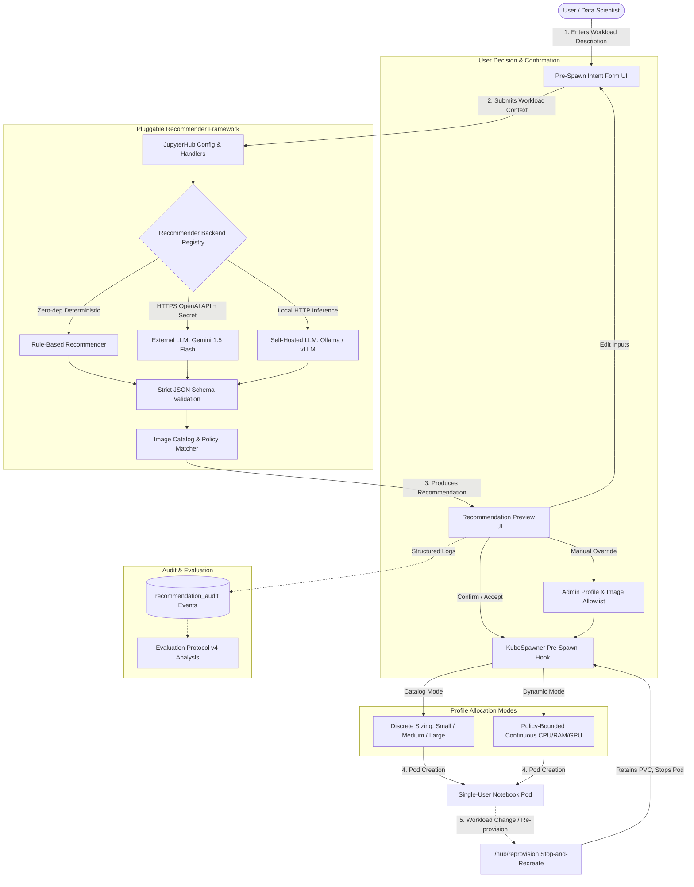
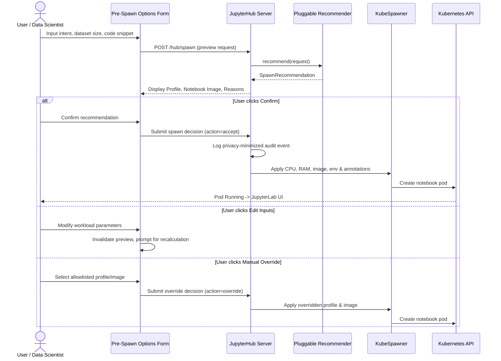

# Architecture

This document explains the system architecture and data flows of the **Intent- and Context-Aware Profile Recommendation for Zero to JupyterHub** research prototype.

It covers the complete feature set:
* **Interactive Recommendation & Preview UI**
* **Curated Notebook Container Image Matching**
* **Pluggable Recommender Engine** (Rule-Based, External LLM API, Self-Hosted LLM)
* **Storage-Preserving Notebook Re-Provisioning**
* **Policy-Bounded Dynamic Resource Sizing**
* **Evaluation Protocol v4 & Benchmarking Suite**

---

## 1. System Overview



---

## 2. Resource Profiles & Image Catalog

### Hardware Resource Profiles
The platform provides both discrete allowlisted profiles and continuous dynamic sizing:

| Profile | CPU Request | CPU Limit | Memory Request | Memory Limit | Target Workload |
| :--- | :--- | :--- | :--- | :--- | :--- |
| `small` | 100m | 500m | 256M | 384M | Basic Python, light scripts, text exploration |
| `medium` | 500m | 1 CPU | 768M | 1G | Data analysis with pandas/NumPy (< 1GB datasets) |
| `large` | 1500m | 2 CPU | 1536M | 2G | ML modeling (scikit-learn, XGBoost) and larger datasets |
| `gpu_or_large` | 1500m | 2 CPU | 1536M | 2G | Deep learning; mapped safely to Large when GPU pool is unavailable |

### Curated Notebook Container Image Catalog
Images are pinned to immutable SHA-256 digests in [`recommender/image-catalog.yaml`](file:///Users/mthang1201/Documents/datn/intent-spawner/recommender/image-catalog.yaml). Users cannot supply arbitrary registry references:

* **`minimal-python`**: Lightweight JupyterLab and Python base environment.
* **`scipy-data-science`**: NumPy, pandas, SciPy, scikit-learn, matplotlib, seaborn.
* **`pytorch-deep-learning`**: PyTorch, torchvision, torchaudio, and CUDA userspace libraries.
* **`tensorflow-deep-learning`**: TensorFlow, Keras, and CUDA userspace libraries.

---

## 3. Pluggable Recommender Architecture

All backends implement the `Recommender` protocol in [`recommender/base.py`](file:///Users/mthang1201/Documents/datn/intent-spawner/recommender/base.py), accepting `RecommendationRequest` and returning a validated `SpawnRecommendation`.

```text
RecommendationRequest
  ├── intent: str
  ├── dataset_size_gb: float
  └── code_context: str
       ↓
Recommender Protocol (recommender/base.py)
  ├── RuleBasedRecommender (recommender/rule_based.py)
  ├── ExternalLLMRecommender (recommender/external_llm.py)
  └── SelfHostedLLMRecommender (recommender/self_hosted_llm.py)
       ↓
PolicyValidator & Schema Validation (RESPONSE_SCHEMA)
       ↓
SpawnRecommendation
  ├── profile: str
  ├── applied_profile: str
  ├── image_id: str
  ├── image_display_name: str
  ├── reasons: list[str]
  ├── score: float | None
  ├── backend_name: str
  ├── policy_version: str
  └── catalog_version: str
```

### Backend Specifications:
1. **Rule-Based Backend** (`rule_based.py`):
   * Fast, deterministic keyword and heuristic extraction.
   * Dataset thresholds: `>= 2.0GB` (+3 score -> `large`), `>= 0.5GB` (+1 score -> `medium`).
   * Training syntax (`.fit(`, `sklearn`) and data syntax (`pandas`, `read_csv`) triggers.
   * Serves as automatic fallback whenever network-based backends fail or timeout.

2. **External LLM Backend** (`external_llm.py`):
   * Uses OpenAI-compatible HTTP chat completions (e.g. Google Gemini 1.5 Flash at `https://generativelanguage.googleapis.com/v1beta/openai/chat/completions`).
   * Authenticates with Kubernetes Secret `intent-spawner-external-llm` (`EXTERNAL_LLM_API_KEY`).
   * Built-in timeout controls, exponential backoff retries, JSON object response format, and fail-closed fallback to `RuleBasedRecommender`.

3. **Self-Hosted LLM Backend** (`self_hosted_llm.py`):
   * Designed for in-cluster or host-local inference (e.g. Ollama with `llama3`, vLLM, LocalAI).
   * Optional bearer token (`SELF_HOSTED_LLM_API_KEY`).
   * Explicit `SELF_HOSTED_LLM_ALLOW_INSECURE_HTTP: "true"` for private internal network boundaries.
   * Reuses identical strict response validation and rule-based safety fallback.

---

## 4. Interactive Pre-Spawn & Preview Workflow



---

## 5. Storage-Preserving Notebook Re-Provisioning

When user workloads change mid-session, users navigate to `/hub/reprovision`:
1. **Workload Update**: Users enter their new intent, dataset size, or code snippet.
2. **Replacement Preview**: The UI displays side-by-side comparisons of the current configuration vs. the proposed recommendation.
3. **Explicit Warning**: The UI clearly states that kernel state, memory variables, and background processes will be discarded.
4. **Stop-and-Recreate**:
   * The old notebook pod is gracefully terminated.
   * A new pod is spawned with the updated resource profile and image.
   * The user's home directory volume (`PersistentVolumeClaim`) is re-attached, preserving all files and saved datasets.

---

## 6. Policy-Bounded Dynamic Resource Sizing

When `RESOURCE_SELECTION_MODE: dynamic` is enabled via [`helm/dynamic-values.yaml`](file:///Users/mthang1201/Documents/datn/intent-spawner/helm/dynamic-values.yaml):
* Instead of jumping directly between fixed tiers, continuous CPU, RAM, and GPU values are calculated within administrator-defined policies (`min_cpu`, `max_cpu`, `step_cpu`, `min_memory_mb`, `max_memory_mb`).
* **Admission Control**: Checks cluster quota headroom before issuing dynamic allocations.
* **Fail-Safe Fallback**: If dynamic sizing exceeds limits or fails admission checks, the system safely reverts to standard Catalog Mode.

---

## 7. Evaluation Protocol v4 & Benchmarking Suite

The evaluation layer ([`evaluation_v4/`](file:///Users/mthang1201/Documents/datn/intent-spawner/evaluation_v4/)) provides a complete scientific benchmark suite:
* **Bilingual 60-Intent Gold Standard**: 60 realistic tasks in English and Vietnamese across 4 workload categories (EDA, Data Processing, ML Training, Deep Learning).
* **Multi-Recommender Benchmarking**: Evaluates Rule-Based, External LLM (Gemini), Self-Hosted LLM (Ollama), and Baseline heuristics.
* **Evaluation Triad**:
  1. *Recommendation Quality*: Profile accuracy, image match accuracy, explainability score, latency, fallback rate.
  2. *System Effectiveness*: Schedulable capacity savings, allocation waste, OOM rate, queue pressure.
  3. *User Decision Impact*: Acceptance rate, manual override frequency, re-provisioning success.
* **Statistical Claim Gates**: Bootstrap confidence intervals and Wilcoxon tests ensuring empirical claims are statistically sound before publication.

