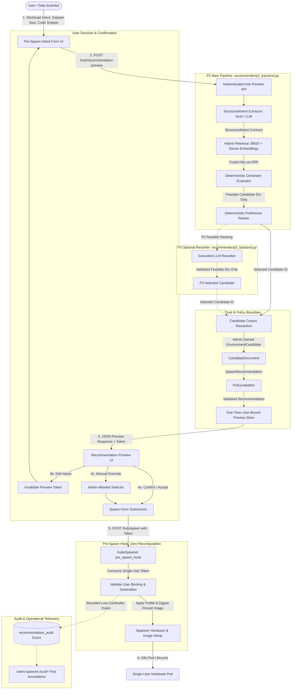

# Architecture

This document explains the system architecture, component contracts, security boundaries, and evaluation framework of the **Intent- and Context-Aware Profile Recommendation for Zero to JupyterHub** research thesis prototype.

---

## 1. Primary Thesis Systems & Research Taxonomy

The thesis registry defines B0, P1, P2, and optional P3. P2 is the main proposed
method; P3 is not retained for primary evaluation. Implemented backend contracts
do not establish that the final Protocol-v5 comparator freeze exists.

| System ID | Name / Description | Pipeline Summary | Research Role |
| :--- | :--- | :--- | :--- |
| **B0** | **Default JupyterHub** | Manual administrator-configured `profileList` selection; no automated recommendation or intent parsing. | Manual baseline for the E3 human study (RQ3); no ranking metrics. |
| **P1** | **Rule-Based Recommender** | Deterministic lexical keyword and heuristic scoring over intent text, dataset size, and code context. | Comparator for E1/E2 (RQ1/RQ2) and fallback backend. |
| **P2** | **Structured Intent + Hybrid Retrieval + Deterministic Constraints** | Natural language request → `StructuredIntent` → BM25 sparse + dense embeddings retrieval → Reciprocal Rank Fusion (RRF) → deterministic hard-constraint filtering → deterministic ranking → corpus resolution. | **Main proposed method**; comparisons are specified in E1–E5. |
| **P3** | **P2 + Retrieval-Grounded LLM Reranker** | Frozen P2 candidate generation and deterministic constraint evaluation → schema-validated LLM reranking of P2-feasible candidate IDs only → corpus resolution. | Optional E6/RQ6 extension; formative gate outcome: `not_retained`. |

### Motivating & Reference Evidence (Direct-LLM Experiments)

Direct end-to-end prompt-to-recommendation LLM backends (`external_llm` via Google Gemini 3.5 Flash and `self_hosted_llm` via local Ollama Llama 3) were evaluated under Protocol v4. They serve as **historical/formative reference evidence** about the recorded pipelines’ latency, reliability, and quality limitations. Head-to-head external-vs-local LLM comparison is **not** a primary research question for the thesis.

---

## 2. End-to-End System Data Flow

The implemented P2 pipeline combines configurable extraction and retrieval with
deterministic constraints/ranking. Extraction or optional P3 reranking can call
an LLM; the diagram describes behavior, not observed Protocol-v5 performance:

---

## 3. Detailed Component Architecture

### 3.1 Structured Intent Extraction (`recommender/structured_intent.py`, `recommender/local_structured_intent.py`)

* Converts untrusted natural language user text into a strictly schema-validated `StructuredIntent` dataclass.
* Captures: `task_types`, `required_features`, `preferred_features`, `forbidden_features`, `required_frameworks`, `preferred_frameworks`, `required_libraries`, `preferred_libraries`, and `resource_constraints` (`gpu_requirement`, `minimum_cpu_cores`, `minimum_memory_gb`, `dataset_size_gb`).
* Explicit user-supplied dataset size from form inputs overrides any inferred value.
* Any extractor failure or malformed JSON deterministically degrades to `DeterministicStructuredIntentExtractor` preserving explicit numeric facts.
* Prompt injection in user text is treated as data, not instruction; candidate IDs, image references, and Kubernetes resource values are prohibited in extracted output.

### 3.2 Hybrid Lexical + Semantic Retrieval (`recommender/sparse_retrieval.py`, `recommender/dense_retrieval.py`, `recommender/hybrid_retrieval.py`)

* **Sparse Channel**: BM25 ranking over tokenized candidate documents derived exclusively from administrator-curated images and profiles.
* **Dense Channel**: Dense vector similarity using versioned feature-hash or embedding providers over candidate representation text.
* **Reciprocal Rank Fusion (RRF)**: Combines ranked lists using $RRF(d) = \sum_{m \in \{sparse, dense\}} \frac{w_m}{k_{rrf} + r_m(d)}$ with deterministic tie-breaking.
* If either channel fails, the retriever gracefully uses available hits or falls back to rule-based recommendations.

### 3.3 Deterministic Constraint Evaluation & Ranking (`recommender/constraint_evaluator.py`)

* Evaluates all retrieved candidate IDs against administrator policy and extracted constraints:
  1. **Hard Constraints**: GPU requirement (e.g. required vs. unavailable in catalog), CPU lower bound, memory lower bound, dataset size sufficiency, and forbidden feature conflicts.
  2. **Soft Preferences**: Weighted matching of preferred libraries, frameworks, and suitability tags.
* Candidates violating any hard constraint are marked `feasible = False` and strictly excluded from ranking.
* Feasible candidates use `0.75 * (1 / fused_rank) + 0.25 * soft_preference_score`, rounded to 12 decimal places, with candidate ID ascending as the final tie-breaker.
* If zero candidates are feasible, `no_feasible_candidate` triggers a fallback requiring mandatory manual override.

### 3.4 Optional P3 Retrieval-Grounded LLM Reranking (`recommender/p3_reranker.py`, `recommender/p3_backend.py`)

* Consumes the complete list of deterministically feasible candidates from P2.
* Reranker prompt provides candidate facts (hardware specs, installed packages) and user context.
* Strict schema validation rejects: unknown candidate IDs, omitted candidate IDs, duplicate candidate IDs, or out-of-bounds scores.
* The model cannot alter resource values, choose arbitrary images, or revive infeasible candidates.
* Any network error, timeout, or schema mismatch immediately degrades to the exact P2 deterministic ranking.

### 3.5 Candidate Corpus Resolution & Trust Boundary (`recommender/candidate_corpus.py`, `recommender/policy.py`)

* Every candidate ID maps to an immutable `CandidateDocument` created from administrator configuration.
* Converts to a trusted `EnvironmentCandidate` and `SpawnRecommendation`.
* `PolicyValidator` acts as the final gate: verifies profile allowlists, pinned image SHA-256 digests, policy versions, and catalog versions before any preview can be issued.

### 3.6 Interactive Preview & Pre-Spawn Binding (`recommender/jupyterhub_integration.py`)

* Previews are server-side, single-use, generation-bound, and tied to the authenticated user with a 30-minute TTL.
* Modifying input parameters invalidates existing preview tokens.
* `pre_spawn_hook` validates the token and consumes it. **Zero recommendation or LLM recomputation occurs during pod spawn.**
* Telemetry and pod annotations log only bounded low-cardinality metadata (`intent-spawner.local/*`), never raw user text, prompts, or code.

---

## 4. Implemented Capabilities

These components and their test suites are available in the repository.
Implementation coverage is separate from experiment execution status; test counts
and source line numbers are omitted because they change as the code evolves.

| Capability | Implementation | Verification entry point | Boundary |
| --- | --- | --- | --- |
| B0 manual selection | `helm/baseline-values.yaml` | `tests/test_helm_recommender_deployment.py` | No rankings or automated recommendation. |
| P1 rules | `recommender/rule_based.py` | `tests/test_p1_regression.py` | Existing comparator; final v5 revision authority remains unverified. |
| P2 structured extraction | `recommender/structured_intent.py`, `recommender/local_structured_intent.py` | `tests/test_structured_intent_extractor.py` | Local or LLM extraction; explicit input and schema boundaries apply. |
| P2 hybrid retrieval | `recommender/sparse_retrieval.py`, `recommender/dense_retrieval.py`, `recommender/hybrid_retrieval.py` | `tests/test_hybrid_retrieval.py` | Curated candidate corpus; retrieval quality requires separate measurement. |
| P2 constraints and backend | `recommender/constraint_evaluator.py`, `recommender/p2_backend.py` | `tests/test_p2_contracts.py`, `tests/test_p2_backend_integration.py` | Feasibility checks and deterministic ranking; fallback is distinct from successful inference. |
| P3 reranking | `recommender/p3_reranker.py`, `recommender/p3_backend.py` | `tests/test_p3_reranker.py` | Implemented optional extension; not retained by the formative gate. |
| Image and profile enforcement | `recommender/candidate_corpus.py`, `recommender/policy.py` | `tests/test_candidate_corpus.py`, `tests/test_adversarial.py` | Administrator allowlists and pinned image identity; functional correctness is measured separately. |
| Preview, confirmation, and bounded audit logging | `recommender/jupyterhub_integration.py` | `tests/test_recommender_backends_integration.py` | Single-use preview state; multi-replica deployments need a shared state design. |
| Notebook reprovisioning | `recommender/jupyterhub_integration.py`, `helm/reprovision-values.yaml` | `tests/test_reprovisioning.py` | Stop/recreate with PVC retention; kernel memory and running processes are lost. |
| Dynamic resource sizing | `recommender/dynamic_resources.py`, `helm/dynamic-values.yaml` | `recommender/test_dynamic_resources.py` | Opt-in min/max/step and GPU rules; static per-spawn caps, no live quota or node-headroom query. |
| Backend deployment | `scripts/install-proposed.sh`, `scripts/recommender_package.py` | `tests/test_helm_recommender_deployment.py` | Versioned runtime package and rollout checksum; default backend is P1. |
| Direct LLM adapters | `recommender/external_llm.py`, `recommender/self_hosted_llm.py` | `recommender/test_external_llm.py`, `recommender/test_self_hosted_llm.py` | Historical reference methods; provider/model availability is an operational dependency. |
| Protocol-v5 experiment harnesses | `evaluation_v5/` | `make v5-test`, `make v5-audit-test` | Harness availability does not supply missing participant, hardware, or storage observations. |

[Deployment](HELM_BACKEND_DEPLOYMENT.md), [reprovisioning](INTENT_AWARE_REPROVISIONING.md),
and [dynamic sizing](DYNAMIC_PROFILE_GENERATION.md) have dedicated operational guides.

---

## 5. Security and Correctness Review

| Risk / Threat Area | Defense & Verification Mechanism | Implemented Safeguard Location | Test Coverage |
| :--- | :--- | :--- | :--- |
| **Prompt Injection** | User input treated strictly as data. Extraction and reranker prompts explicitly forbid instruction execution. Output fields are schema-validated against fixed types/enums; raw commands cannot bypass constraints. | `structured_intent.py`, `p3_reranker.py` | `tests/test_adversarial.py` |
| **Invented Candidate IDs** | Output candidate IDs are checked against valid administrator corpus IDs. P3 reranker rejects unknown, duplicate, or missing IDs and validates candidate count. | `p3_reranker.py`, `p2_backend.py` | `tests/test_p3_reranker.py`, `tests/test_adversarial.py` |
| **Arbitrary Image / Profile References** | AI models cannot output image URLs or raw resources. Output must resolve to a `CandidateDocument` from `image-catalog.yaml`. `PolicyValidator` verifies profile against allowlist and image against pinned SHA-256 digest. | `policy.py`, `candidate_corpus.py` | `tests/test_adversarial.py`, `tests/test_p2_contracts.py` |
| **Stale Embedding Index** | Dense and hybrid index versions and SHA-256 checksums are tracked in metadata. Preview generation includes index versions/checksums; changes invalidate unconsumed tokens. | `dense_retrieval.py`, `jupyterhub_integration.py` | `tests/test_dense_retrieval.py`, `tests/test_hybrid_retrieval.py` |
| **Stale Candidate Catalog** | Catalog version checked at startup and during `PolicyValidator.validate()`. Mismatched catalog version raises an immediate validation error. | `policy.py`, `p2_backend.py` | `tests/test_candidate_corpus.py`, `tests/test_config_validation.py` |
| **Malformed StructuredIntent** | Strict JSON decoding and schema validation (`_strict_json_object`). Parsing errors trigger safe degradation to `DeterministicStructuredIntentExtractor` with explicit values only. | `structured_intent.py` | `tests/test_structured_intent_extractor.py` |
| **Malformed Reranker Output** | Reranker validates JSON structure, required fields, score bounds $[0.0, 1.0]$, and ID completeness. Any failure immediately degrades to exact P2 ranking. | `p3_reranker.py`, `p3_backend.py` | `tests/test_p3_reranker.py` |
| **Provider Timeout / Failure** | Explicit deadlines, retry backoff, and non-blocking timeout handling (`network_work_deadline`). Failures degrade smoothly to deterministic fallback without blocking the user. | `structured_intent.py`, `p3_reranker.py`, `reliability.py` | `recommender/test_reliability.py`, `tests/test_p2_backend_integration.py` |
| **Embedding Failure** | Dense retrieval errors catch exceptions and allow sparse-only fallback or complete P1 fallback with `infrastructure_provider_failure` category. | `p2_backend.py` | `tests/test_dense_retrieval.py`, `tests/test_p2_backend_integration.py` |
| **Sparse / Dense Channel Failure** | RRF handles partial hits; empty fused results trigger graceful fallback with `retrieval_empty` category. | `p2_backend.py`, `hybrid_retrieval.py` | `tests/test_hybrid_retrieval.py` |
| **No Feasible Candidate** | Deterministic evaluator checks hard constraints. If all candidates are infeasible, `no_feasible_candidate` or `unsupported_catalog` flag requires explicit manual user override. | `constraint_evaluator.py`, `p2_backend.py`, `jupyterhub_integration.py` | `tests/test_constraint_evaluator.py`, `tests/test_p2_backend_integration.py` |
| **Mandatory GPU without Catalog GPU** | Evaluator marks all candidates violating `gpu_not_available` as infeasible. Sets `no_feasible_candidate=True` and blocks automated spawn without manual override. | `constraint_evaluator.py` | `tests/test_constraint_evaluator.py` |
| **Privacy Regression** | Free-form intent text, code context, prompts, retrieved documents, and raw model completions are transient and **never** stored in preview records, logs, or pod metadata. | `jupyterhub_integration.py` | `tests/test_adversarial.py`, `tests/test_historical_evidence_immutability.py` |
| **Raw User Text in Logs** | `recommendation_audit` logs only low-cardinality metadata (event UUID, backend name, profile, image ID, latency, attempt count, fallback category). | `jupyterhub_integration.py` | `tests/test_adversarial.py` |
| **Policy Bypass** | Every recommendation passes through `PolicyValidator` before preview and is verified again during `pre_spawn_hook`. Forged form submissions are rejected. | `jupyterhub_integration.py` | `tests/test_adversarial.py` |
| **Preview Replay** | Preview tokens are single-use (`consume=False` on check, popped from preview dictionary upon spawn). Replay attempts fail with `already used`. | `jupyterhub_integration.py` | `tests/test_adversarial.py` |
| **Preview Invalidation on Edit** | Client UI clears preview and resets state on form edit. Server validates exact token binding; mismatched options fail pre-spawn validation. | `jupyterhub_integration.py` | `tests/test_adversarial.py` |
| **Manual Override Integrity** | Overrides must select from `PROFILE_RESOURCES` and `image-catalog.yaml`. Unlisted profiles or image IDs are strictly rejected. | `jupyterhub_integration.py` | `tests/test_adversarial.py` |
| **No Pre-Spawn Recomputation** | `pre_spawn_hook` retrieves the existing confirmed preview decision from memory. It performs zero model inference, zero network calls, and zero recomputation. | `jupyterhub_integration.py` | `tests/test_recommender_backends_integration.py` |

---

## 6. Evidence Status

The [Protocol-v5 final report](evaluation/PROTOCOL_V5_FINAL_REPORT.md) is the
current evidence authority. Its audit verdict is **FAIL**, and all confirmatory
hypothesis decisions remain **NOT EXECUTED**. It reports exact values, provenance,
uncertainty where supported, and missing evidence without substituting fixtures.

- **E1:** 36 development recommendation records across 18 cases and 10 families.
  Complete component/statistical analyses are **NOT EXECUTED**.
- **E2:** formal natural-language robustness analysis is **NOT EXECUTED**.
- **E3:** B0-versus-P2 human crossover study is **NOT EXECUTED**; zero participant sessions.
- **E4:** resource-efficiency and calibration evidence consists of readiness/planning
  packages; hardware outcomes are **NOT EXECUTED**.
- **E5:** development container functional observations exist. Two packages pass
  current validation but retain pipeline-provenance limitations. Each run is
  reported separately. Image storage measurements are **NOT EXECUTED**.

The [Protocol-v4 combined report](evaluation/PROTOCOL_V4_REVISED_EVALUATION_REPORT.md)
and [P2 integration evaluation](evaluation/P2_BACKEND_EVALUATION_V1.md) remain
historical/formative evidence. Their samples, comparators, and RQ numbering must
not be relabeled as Protocol-v5 confirmation. The preserved v4 Stage C evidence
covers one disposable node and eight workload families, limiting generalization.

The [P3 formative decision](evaluation/P3_INCREMENTAL_EVALUATION_V1.md) used 60
Protocol-v4 queries plus six diagnostics. It found no wrong-to-correct change,
one correct-to-wrong regression, invalid reranker outputs, and increased latency.
P3 was **not retained**. This negative finding is preserved; it is not a completed
Protocol-v5 E6 confirmatory experiment.

Workload families are the semantic independent unit for offline/resource
inference. Repetitions estimate within-family stability/runtime variation. Human
analysis follows its participant/task pairing; B0 has no ranking metrics.

## 7. Remaining Research and Production Boundaries

The backend is implemented. Research completion requires evidence that the
current repository does not supply:

- An authoritative final Protocol-v5 freeze binding comparator revisions,
  configuration, catalog/index/prompt identities, and split checksums before
  confirmation, with safe custodian attestation. The existing configuration
  snapshot and historical `evaluation_final` freeze do not establish this.
  Follow the [v5 isolation contract](evaluation/PROTOCOL_V5_DATA_ISOLATION.md);
  sealed cases must never enter implementation or tuning.
- Real B0-versus-P2 sessions under the [E3 study contract](evaluation/PROTOCOL_V5_USER_STUDY.md),
  retaining privacy and declared crossover pairing. E3 corresponds to v5 RQ3.
- Eligible, frozen cluster and approved oracle evidence for E4, plus actual
  image-layer measurements with immutable digest/platform identity for E5 storage.
- Authenticated inputs for unavailable analyses and documented resolution of
  integrity/provenance failures. Any correction must be a separate linked artifact;
  original source evidence and contradictory results stay preserved.

Production multi-node and multi-tenant validation remains outside the observed
scope. History-aware recommendation is future work; no history store or evaluated
history-aware method is claimed. Dynamic sizing does not inspect live quota,
per-user usage, or node headroom; Kubernetes admission remains authoritative.
Monetary cost and energy savings are not established by the available evidence.

The [artifact index](ARTIFACT_MANIFEST.md) identifies portable cores and external
archive boundaries. Manuscript results should cite the final report’s precise
metrics and evidence class, keeping design, development, and historical outcomes
separate from confirmation.
