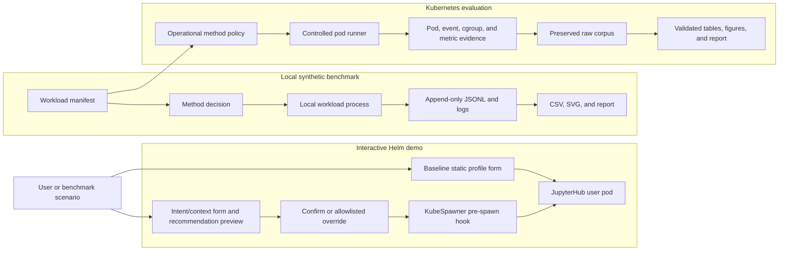
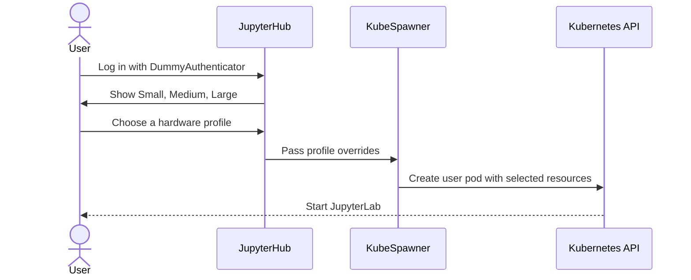
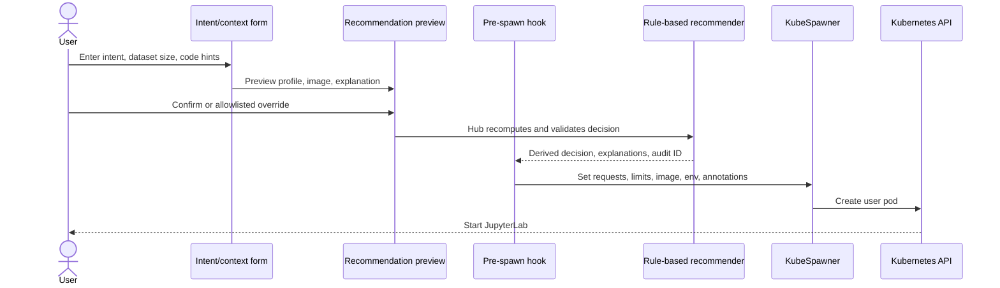
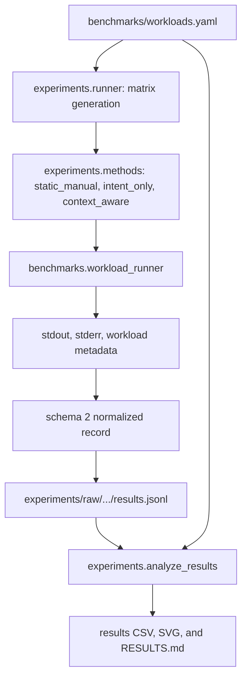
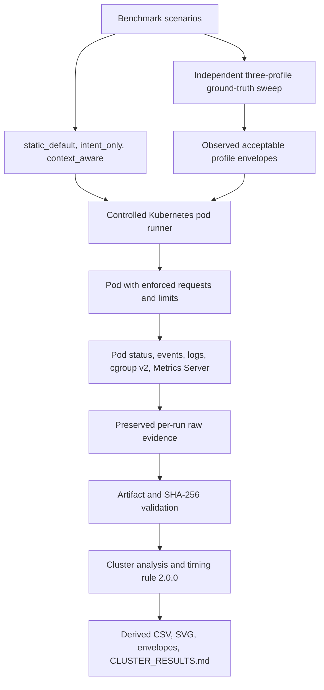

# Architecture

This document explains how the repository's components fit together. It
separates the interactive Helm demo, local synthetic benchmark, and
Kubernetes-backed evaluation because they use different execution and evidence
paths.

For commands, see [Getting Started](GETTING_STARTED.md). For the presentation
flow, see [Demo Script](../DEMO_SCRIPT.md).

## System Overview

The three paths share profile concepts and recommendation logic, but they do
not share runtime measurements or claim boundaries.

## Profile Model

The approved CPU profiles are:

| Profile | CPU request | CPU limit | Memory request | Memory limit | Typical demo meaning |
| --- | ---: | ---: | ---: | ---: | --- |
| `small` | 100m | 500m | 256M | 384M | Basic Python and light notebooks |
| `medium` | 500m | 1 CPU | 768M | 1G | Moderate data exploration |
| `large` | 1500m | 2 CPU | 1536M | 2G | Training-like or larger data workloads |

Kubernetes evaluation code also records normalized MiB values because decimal
Kubernetes quantities such as `256M` are not equal to `256Mi`.

`gpu_or_large` is a recommendation signal, not an actual GPU profile in this
artifact. The demo has no GPU pool. The Helm path maps it to Large resources,
while evaluation policies may map or reject it according to the workload's
allowed profiles.

## Rule-Based Recommendation

The standalone implementation is in `recommender/recommender.py`. It accepts:

- `intent`;
- `dataset_size_gb`; and
- `code_context`.

The rule set is intentionally small and explainable:

| Signal | Effect |
| --- | --- |
| GPU/deep-learning term | Return `gpu_or_large` immediately with a no-real-GPU explanation |
| Dataset size at least 2.0 GB | Add 3 points |
| Dataset size at least 0.5 GB but below 2.0 GB | Add 1 point |
| Data-processing term | Add 1 point |
| Training/modeling term | Add 2 points |
| Total score at least 3 | Recommend `large` |
| Total score from 1 to 2 | Recommend `medium` |
| Total score 0 | Recommend `small` |

Invalid, missing, or negative dataset-size inputs are treated as unknown
(`0.0`). Reasons are kept as human-readable strings. A second deterministic
rule set maps matched software capabilities to an immutable image in
`recommender/image-catalog.yaml`; the default is `minimal-python`, data and
classical-ML terms map to `scipy-data-science`, and framework-specific terms
map to the PyTorch or TensorFlow catalog entries.

The implementation under `helm/proposed-values.yaml` mirrors this logic inside
JupyterHub `hub.extraConfig`. It is duplicated because the live Helm prototype
must execute inside the Hub process before a user server starts. Unit tests
exercise both the standalone module and the compiled embedded configuration;
Helm rendering checks that the values are packaged into the chart correctly.

## Path 1: Interactive Helm Demo

### Baseline

`helm/baseline-values.yaml` uses JupyterHub's static `profileList`. The user
selects hardware directly. Each profile supplies KubeSpawner CPU, memory, and
an identifying environment variable.

### Proposed method

The proposed Helm configuration provides:

- an HTML form with Preview, Confirm, Edit, and Manual Override states;
- input parsing, negative-size normalization, and server-side recomputation;
- an administrator-owned immutable image allowlist;
- a pre-spawn hook;
- profile-to-resource and image-ID-to-reference mapping;
- derived recommendation/applied environment variables;
- allowlisted `z2jh-context-demo.local/*` annotations; and
- one structured accept/override audit event per confirmed spawn.

The recommendation is applied before pod creation only after confirmation.
The pod specification, environment, annotations, and privacy-minimized Hub
audit logs provide observable evidence that the reviewed choice was enforced.
See [Recommendation Preview Design](evaluation/RECOMMENDATION_PREVIEW_DESIGN.md)
for the state machine and scalability assessment.

### Demo support components

| Component | Role |
| --- | --- |
| `scripts/install-baseline.sh` | Creates the namespace and workload ConfigMap, then installs baseline values |
| `scripts/install-proposed.sh` | Upgrades the same release with context-aware values |
| `scripts/port-forward.sh` | Maps local port 8000 to the JupyterHub proxy service |
| `scripts/watch-pods.sh` | Watches namespace pod status |
| `workload/` | Bounded scripts mounted through the `demo-workload` ConfigMap |
| `scripts/demo-*.sh` | Creates controlled pods for failure and reservation demonstrations |
| `scripts/uninstall.sh` | Deletes only the configured demo namespace |

The demo uses no persistent JupyterHub storage. Deleting the namespace removes
the demo's Kubernetes state.

## Path 2: Local Synthetic Benchmark

### Workload manifest

`benchmarks/workloads.yaml` is metadata-first. Each scenario declares:

- a stable workload ID and category;
- natural-language intent;
- a dataset-size hint;
- code-context hints;
- deterministic seed;
- executable workload command;
- timeout;
- expected acceptable profiles;
- policy constraints where relevant; and
- synthetic-data and license information.

The dataset-size hint is an input to the recommender. It is not a measured file
size.

### Local comparison methods

| Method | Inputs used | Selection behavior |
| --- | --- | --- |
| `static_manual` | Approved acceptable-profile metadata and policy | Deterministically selects the smallest approved acceptable profile |
| `intent_only` | Intent and policy | Calls the recommender with dataset size zero and empty code context |
| `context_aware` | Intent, dataset-size hint, code-context hints, and policy | Uses all permitted pre-spawn inputs |

`static_manual` is designed as a careful deterministic comparator, not as an
intentionally bad Small-only baseline.

### Execution and recording

`experiments.runner` creates an immutable experiment directory, plans the
matrix, records environment metadata, and invokes `experiments.recorder`.

`benchmarks.workload_runner` uses deterministic generated data and standard
library operations. It does not require pandas, scikit-learn, TensorFlow, or a
GPU. Temporary files are deleted before the workload exits.

Every attempted workload preserves stdout and stderr before appending a
normalized JSON object to `results.jsonl`. Resume mode skips only combinations
already represented by a raw record.

### Analysis

`experiments.analyze_results` reads raw JSONL without modifying it and produces:

- method summaries;
- run counts and exclusions;
- recommendation outcomes;
- memory-request and runtime comparisons;
- ablation and boundary summaries;
- per-workload tables; and
- SVG figures and a Markdown report.

Local peak memory comes from process-level instrumentation. It is not a
Kubernetes pod memory measurement.

## Path 3: Kubernetes-Backed Evaluation

### Operational methods

| Method | Inputs used | Behavior |
| --- | --- | --- |
| `static_default` | Fixed deployment default and permitted policy only | Applies Medium to every workload unless policy changes it |
| `intent_only` | Intent and permitted policy | Does not receive dataset or code context |
| `context_aware` | Intent, dataset-size hint, derived context signals, and policy | Uses permitted pre-spawn context |

The cluster baseline is called `static_default`, not `static_manual`. It models
a deployment-wide Medium default and is intentionally isolated from workload
ground truth.

### Independent ground truth

The ground-truth sweep forces every workload under Small, Medium, and Large
without calling the recommender. Repeated outcomes determine reliable profiles.
Timing and memory-waste rules then derive an observed acceptable envelope.

Manifest expectations are not used as operational ground truth for this stage.
This prevents the recommender's own labels from defining its success.

### Evidence collection

The runner enforces the chosen profile in the first container's requests and
limits. A label alone is not accepted as proof of profile application.

Preserved sources include:

- normalized records;
- sanitized pod and event evidence;
- pod logs;
- cgroup-v2 CPU and memory observations;
- Metrics Server snapshots or explicit unavailability; and
- cleanup status.

Missing measurements remain null. Requests and limits are never substituted
for missing usage.

### Measurement semantics

- Cgroup-v2 `memory.peak` is a genuine container-boundary memory peak.
- Metrics Server provides sampled observations and can miss short jobs.
- Historical CPU values include full-window averages and legacy hybrid maxima;
  they are not continuous CPU peaks.
- Kubernetes timestamps in the retained corpus have one-second resolution.
  Timing rule 2.0.0 treats durations as intervals and does not add an arbitrary
  offset.

Read the
[Kubernetes Cluster Experiment Protocol](evaluation/CLUSTER_EXPERIMENT_PROTOCOL.md)
and [Result Schema](evaluation/RESULT_SCHEMA.md) before interpreting these
fields.

### Integrity and derived outputs

`cluster_evaluation.validate_artifacts` checks corpus structure and cross-file
consistency. `cluster_evaluation.raw_integrity` checks tracked raw bytes against
the SHA-256 manifest.

`cluster_evaluation.analyze` creates derived cluster tables, figures, observed
resource envelopes, and `docs/evaluation/CLUSTER_RESULTS.md`. Derived files may
be regenerated; raw evidence must not be rewritten.

## Data Classes and Ownership

| Data class | Main location | Mutation rule |
| --- | --- | --- |
| Source and configuration | `recommender/`, `helm/`, `benchmarks/`, `cluster_evaluation/` | Changed through normal reviewed development |
| New local raw runs | `experiments/raw/<experiment-id>/` | Append-only; ignored until explicitly reviewed |
| Preserved local raw snapshots | `experiments/raw/2026.../` | Committed evidence; do not edit |
| Local derived outputs | `results/`, `experiments/summaries/` | Regenerable from raw records |
| Preserved cluster raw evidence | `results/cluster/raw/` | Committed evidence protected by integrity checks |
| Cluster derived outputs | `results/cluster/derived/`, observed envelopes, cluster report | Regenerable from validated raw evidence |
| Protocols and audit records | `docs/evaluation/` | Source of truth for interpretation and claim boundaries |

## Directory Responsibilities

| Directory | Primary responsibility |
| --- | --- |
| `benchmarks/` | Workload definitions and portable execution |
| `cluster_evaluation/` | Controlled Kubernetes execution and analysis |
| `docs/` | Onboarding, architecture, governance, protocols, and reports |
| `experiments/` | Local orchestration, recording, schema, and analysis |
| `helm/` | Interactive JupyterHub prototype configuration |
| `k8s/` | Simple request/quota demonstration manifests |
| `recommender/` | Reusable recommendation function and tests |
| `results/` | Derived local outputs and cluster evidence/results |
| `scripts/` | Operator-facing entry points |
| `tests/` | Automated validation and sanitized fixtures |
| `workload/` | Bounded live-demo scripts |

## Security and Privacy Boundaries

The demo uses `DummyAuthenticator` and must remain local. It is not a production
authentication configuration.

The artifact does not retain raw notebooks, raw code context, datasets,
secrets, or user identities. Evaluation records store derived context terms,
declared hints, resource evidence, and allowlisted metadata only.

Preview options forms embed catalog definitions and script constants using context-safe JSON serialization (`safe_json_dumps`), replacing `<`/`>`/`&`/`'` with Unicode escape sequences (`\u003c`, `\u003e`, `\u0026`, `\u0027`) to prevent inline script XSS context breakout. Preview state is process-local for single-Hub deployment scope (`hub.replicas: 1`) and invalidates fail-closed on Hub restart.

For complete rules, read [Data Governance](DATA_GOVERNANCE.md).

## What the Architecture Can Demonstrate

The repository can demonstrate that:

- intent and lightweight context can be mapped to an approved pre-spawn
  profile;
- the mapping is explainable;
- a KubeSpawner hook can apply the recommendation before pod creation;
- comparison methods can be isolated and executed deterministically; and
- raw evidence can be validated and regenerated into auditable reports.

It does not establish production-wide efficiency, real-user satisfaction,
multi-node scheduler behavior, GPU performance, or history-aware provisioning.
