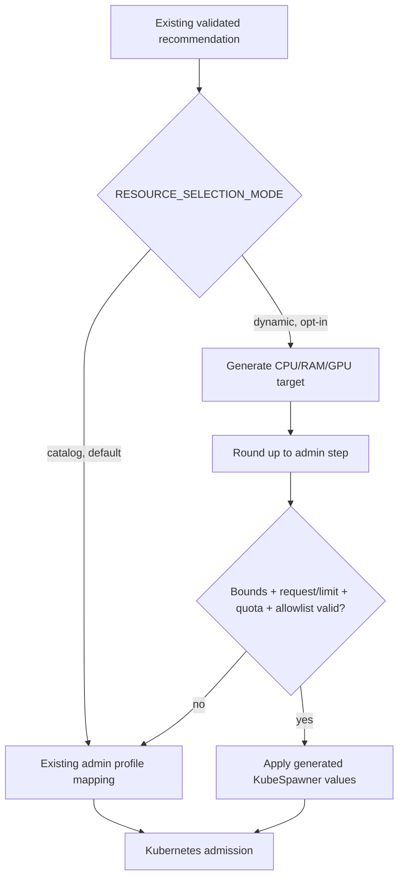

# Policy-bounded Dynamic Profile Generation

Task E is an opt-in extension over the existing profile catalog. It generates
CPU, memory, and GPU quantities from bounded workload signals, validates every
quantity against administrator policy, and falls back to the existing catalog
decision when a candidate cannot be applied safely.

The committed default remains **Catalog Mode**. No current spawn changes unless
an administrator explicitly applies `helm/dynamic-values.yaml` or sets
`RESOURCE_SELECTION_MODE=dynamic` in another adapter.

## Scope and claim boundary

This implementation provides:

- strict policy parsing for min, max, step, quota caps, catalog profile
  allowlists, and GPU extended-resource allowlists;
- deterministic CPU, memory, and GPU candidate generation;
- validation of requests versus limits, stepped ranges, configured quota caps,
  optional runtime quota headroom, and GPU resource names;
- per-candidate fallback to the existing Catalog Mode mapping;
- a reversible Catalog/Dynamic mode switch;
- preview CLI, additive audit metadata, unit tests, and an opt-in Helm adapter.

It does not claim to predict true resource demand, discover GPU node capacity,
reserve namespace quota, or eliminate Kubernetes admission races. The local
tests are deterministic validation evidence, not observed cluster performance.
No cluster-mutating command was run while implementing Task E.

## Decision flow



The recommender still decides workload class and notebook image. The new
`ResourceSelector` is a separate application layer, so backend changes do not
bypass deployment policy and Catalog Mode callers do not receive generated
quantities.

## Administrator policy

The default policy is
[`recommender/resource-policy.yaml`](../recommender/resource-policy.yaml).
Its schema is intentionally strict: missing or unknown fields, booleans used as
integers, invalid ranges, zero steps, duplicate allowlist entries, impossible
quota minima, and GPU ranges without an extended-resource allowlist all prevent
startup.

| Field | Meaning |
| --- | --- |
| `policy_version` | Audit/version identifier for generated decisions |
| `default_mode` | `catalog` or `dynamic`; committed value is `catalog` |
| `fallback_profile` | Admin-approved last-resort catalog profile |
| `allowlist.catalog_profiles` | Profiles that fallback is allowed to apply |
| `allowlist.gpu_resources` | Ordered Kubernetes extended-resource names, such as `nvidia.com/gpu` |
| `dynamic.*.min/max/step` | Inclusive stepped range for each request, limit, or GPU count |
| `dynamic.quota` | Conservative per-spawn caps checked before Kubernetes admission |

Step alignment is relative to `min`, not zero. For example, `min: 256` and
`step: 128` permit 256, 384, 512, and so on up to `max`. Generation always
rounds upward so the selector does not undercut its own estimated target.

The demo policy sets GPU min/max/quota to zero and leaves the GPU allowlist
empty because the repository documents no real GPU pool. A `gpu_or_large`
recommendation therefore falls back to the existing `large` catalog profile.
Enabling GPU output requires all of the following in one reviewed policy
change:

```yaml
allowlist:
  catalog_profiles: [small, medium, large]
  gpu_resources: [nvidia.com/gpu]
dynamic:
  gpu_count: {min: 0, max: 1, step: 1}
  quota:
    cpu_limit_millicores: 2000
    memory_limit_mib: 2048
    gpu_count: 1
```

This only permits an extended-resource request. The cluster must separately
have matching device-plugin, schedulable node, taint/toleration, and quota
configuration.

## Deterministic generator

`ResourceSelector` consumes only the already-derived profile, backend score,
and normalized dataset-size hint. It applies a small catalog-class floor and
then calculates continuous targets:

```text
CPU request target (m) = 100 + 200 × dataset_GB + 100 × bounded_score
RAM request target (MiB) = 256 + 384 × dataset_GB + 96 × bounded_score
CPU limit target = max(profile floor, aligned CPU request + 400m)
RAM limit target = max(profile floor, aligned RAM request + 256MiB)
```

Scores are defensively normalized to the range 0–10. Invalid or negative
dataset/score hints become zero. Profile floors prevent a large-class decision
from being reduced to a small allocation. The candidate is rejected rather
than clamped when a target exceeds the maximum; silent clamping could disguise
an allocation that the policy cannot safely satisfy.

This formula is deliberately explainable and testable. It is a policy-bound
prototype, not a learned sizing model. Changing coefficients should be treated
as a versioned policy/algorithm change and evaluated separately.

## Validation and fallback semantics

Validation is split by failure class:

| Failure | Behavior | Rationale |
| --- | --- | --- |
| Invalid admin policy or unknown mode | Fail startup/configuration | No trusted policy exists for fallback |
| Off-step/out-of-range generated value | Fall back to Catalog Mode | Existing profile mapping remains available |
| Request exceeds limit | Fall back to Catalog Mode | Reject invalid pod resource semantics |
| Configured quota cap exceeded | Fall back to Catalog Mode | Candidate is outside admin budget |
| Optional quota headroom exceeded | Fall back to Catalog Mode | Conservative response to current capacity snapshot |
| GPU count/resource not allowlisted | Fall back to Catalog Mode | Never invent an extended resource |
| Manual Override | Apply the selected allowlisted catalog profile | Preserve explicit current flow |
| Kubernetes admission rejection | Spawn fails normally | API server is authoritative under concurrency |

Live namespace headroom can be supplied as `QuotaCaps`, but this is only a
snapshot. Another pod can consume quota between selection and pod creation.
The selector therefore never claims to reserve quota; ResourceQuota admission
remains the final enforcement point.

Fallback is recorded through:

- `RESOURCE_SELECTION_MODE_REQUESTED` and
  `RESOURCE_SELECTION_MODE_APPLIED` environment variables;
- `z2jh-context-demo.local/resource-mode-*` annotations;
- the truncated `dynamic-fallback` annotation when applicable; and
- a structured `dynamic_resource_audit` Hub log event.

Raw intent, code, dataset contents, usernames, and secrets are not added to the
dynamic audit event.

## Mode transition and rollback

The base installation stays in Catalog Mode:

```bash
bash scripts/install-proposed.sh
```

Preview either mode locally without creating a pod:

```bash
.venv/bin/python scripts/preview-resource-decision.py \
  --mode catalog \
  --intent "explore a CSV file" \
  --dataset-gb 0.8 \
  --code-context "import pandas as pd"

.venv/bin/python scripts/preview-resource-decision.py \
  --mode dynamic \
  --intent "explore a CSV file" \
  --dataset-gb 0.8 \
  --code-context "import pandas as pd"
```

On a disposable local cluster only, opt in with the separate overlay installer:

```bash
kubectl config current-context
bash scripts/install-dynamic.sh
```

The equivalent Helm values order is:

```bash
helm upgrade --install context-demo jupyterhub/jupyterhub \
  --version 4.0.0 \
  --namespace z2jh-context-demo \
  --values helm/proposed-values.yaml \
  --values helm/dynamic-values.yaml \
  --values helm/reprovision-values.yaml
```

Rollback requires no data migration: upgrade again without
`helm/dynamic-values.yaml`, or set `RESOURCE_SELECTION_MODE=catalog` in the
deployment adapter. Existing Catalog Mode profile/image validation remains the
same. A running pod is not resized in place; the selected mode applies to a new
spawn or explicit re-provision operation.

## Verification

The non-mutating checks for this extension are:

```bash
.venv/bin/python -m pytest \
  recommender/test_dynamic_resources.py \
  tests/test_dynamic_profile_overlay.py
python3 -m compileall -q recommender scripts/preview-resource-decision.py
bash -n scripts/*.sh
```

When Helm and the chart repository are available, render both paths and inspect
the output without applying it:

```bash
helm template context-demo jupyterhub/jupyterhub \
  --version 4.0.0 \
  --namespace z2jh-context-demo \
  --values helm/proposed-values.yaml >/tmp/intent-spawner-catalog-render.yaml

helm template context-demo jupyterhub/jupyterhub \
  --version 4.0.0 \
  --namespace z2jh-context-demo \
  --values helm/proposed-values.yaml \
  --values helm/dynamic-values.yaml >/tmp/intent-spawner-dynamic-render.yaml
```
