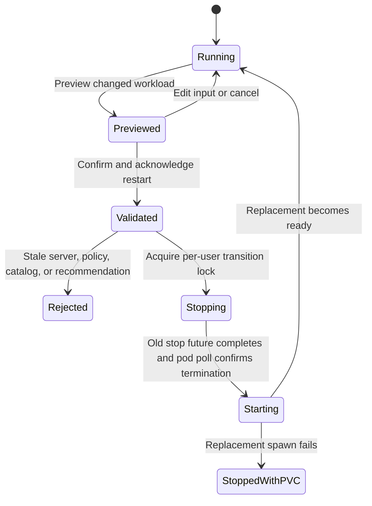

# Intent-aware Re-provisioning (Task D)

## Scope

This design lets an authenticated user describe a changed workload after their
default notebook server is running. The Hub recomputes a recommendation,
previews the current and proposed configurations, requires an explicit restart
acknowledgement, stops the old pod, and starts a replacement pod with the new
allowlisted resources and image.

The operation is **re-provisioning**, not migration:

- there is no live migration;
- kernel variables, active computations, terminals, processes, and other
  in-memory state are not retained;
- files must be saved under `/home/jovyan` before confirmation; and
- the same per-user PersistentVolumeClaim (PVC) is mounted into the replacement
  pod, so saved home-directory files survive the pod replacement.

The implementation targets the repository's disposable local demo. It does not
claim transparent resizing, zero downtime, or production-grade recovery.

## Deployment composition

`helm/reprovision-values.yaml` is applied after `helm/proposed-values.yaml`.
The overlay intentionally reuses the proposed path's trusted objects:

- the server-side preview builder recomputes the recommendation; a compatibility
  adapter uses the original inline `recommend_workload` contract when the
  pluggable `build_preview_payload` function is not present;
- `context_options_from_form` validates accept/override decisions and allowlists;
- `context_pre_spawn_hook` applies the resource and image policy; and
- `PolicyValidator` remains the backend-neutral trust boundary.

The proposed installer applies both values files. Keeping Task D in an overlay
makes the stop/start transaction and persistence change explicit while avoiding
a second copy of recommendation or resource rules.

The chart version used by the repository includes JupyterHub 5.2.1 and
KubeSpawner 7. JupyterHub's supported server lifecycle exposes separate stop and
start operations, while Zero to JupyterHub dynamic storage reuses a pre-existing
per-user PVC on later starts. See the official
[JupyterHub server API](https://jupyterhub.readthedocs.io/en/5.2.1/reference/rest-api.html)
and [Zero to JupyterHub storage guide](https://z2jh.jupyter.org/en/stable/jupyterhub/customizing/user-storage.html).

## User flow

1. Start a notebook through the normal recommendation-confirmation form.
2. Save notebooks and other files under `/home/jovyan`.
3. Open `/hub/reprovision` while the default server is running.
4. Enter the new intent, dataset estimate, and optional code context.
5. Select **Preview replacement**. No pod is changed at this point.
6. Review current versus proposed profile/image, reasons, and restart warnings.
7. Check the acknowledgement that kernel and terminal state will be lost.
8. Select **Stop old pod and create replacement**.
9. Follow the standard JupyterHub spawn-progress page to the replacement server.

## User flow

1. Start a notebook through the normal recommendation-confirmation form.
2. Save notebooks and other files under `/home/jovyan`.
3. Open `/hub/reprovision` while the default server is running.
4. Enter the new intent, dataset estimate, and optional code context.
5. Select **Preview replacement**. No pod is changed at this point.
6. Review current versus proposed profile/image, reasons, and restart warnings.
7. Check the acknowledgement that kernel and terminal state will be lost.
8. Select **Stop old pod and create replacement**.
9. Follow the standard JupyterHub spawn-progress page to the replacement server.

The Task D handler accepts `action: "accept"` for confirmed re-provisioning. Manual override (`action: "override"`) is intentionally disabled during re-provisioning to prevent unpreviewed profile/image forgery; only administrator-approved, server-recomputed recommendations matching the previewed contract are applied.

## State machine



Preview is read-only. The irreversible boundary is confirmation: after trusted
server-side recomputation and validation, the current pod is stopped. If the
new spawn fails, the user has no running server, but the PVC remains available
for a later retry through the ordinary spawn flow.

## Request and stale-preview contract

`POST /hub/reprovision` is an authenticated, same-origin, XSRF-protected Hub
handler. The browser never supplies resource quantities or image references.

Preview accepts only:

- `action: preview`;
- `intent`;
- `dataset_size_gb`; and
- `code_context`.

Confirmation additionally carries:

- `action: accept`;
- the re-provision preview schema version;
- an explicit restart acknowledgement;
- the current server's recommendation event ID;
- the previewed recommended profile and image ID; and
- the previewed policy and catalog versions.

The Hub recomputes through the configured backend and compares these fields.
Any changed current event, recommendation, policy, or catalog rejects the
confirmation and requires another preview. Submitted recommended values are
never applied directly.

When the dynamic resource allocation overlay is enabled, the preview token
(`dynamic_preview_id`) is validated and consumed (single-use) upon confirmation,
preventing preview token replay attacks.

Only the derived decision enters `user_options`. Raw intent and code context do
not enter pod environment, annotations, or audit records.

## Stop/start transaction and PVC invariant

The ordered transaction is:

```text
validate preview and allowlists
  -> acquire in-Hub per-user task lock
  -> request graceful stop
  -> await the complete stop future
  -> poll until the old pod is confirmed terminated (bounded timeout)
  -> start the replacement with new user_options
  -> let the existing pre-spawn policy apply resources and image
```

JupyterHub may return from its stop helper after `slow_stop_timeout` while the
underlying pod is still terminating in Kubernetes. Task D awaits the returned
future and performs a bounded polling loop (up to `slow_stop_timeout + 20s`)
until `old_spawner.poll()` confirms the old pod is no longer running before
invoking `spawn_single_user`.

The overlay changes `singleuser.storage.type` from `none` to `dynamic` and
requests a bounded `1Gi` home volume for the demo. KubeSpawner's stable
per-user claim identity is independent of the disposable pod identity. The
transaction never deletes a PVC. Namespace cleanup remains destructive and
will delete the demo namespace and its claims, as documented in `CLEANUP.md`.

The storage guarantee is limited to data actually flushed to the mounted home
filesystem. Unsaved editor buffers, uncheckpointed notebooks, open file buffers,
temporary container paths outside the mount, and kernel memory are not covered.

### Operational Limitation — Multi-Node ReadWriteOnce PVC Attachment

In multi-node Kubernetes clusters with `ReadWriteOnce` (RWO) storage classes (e.g. cloud block storage), Kubernetes cloud volume detachment can take 10 to 60 seconds after pod deletion. If the replacement pod is scheduled on a different worker node before the volume attachment is fully released, Kubernetes may emit a `Multi-Attach error for volume` until attachment cleanup completes. For production multi-node deployments, node affinity rules or storage attachment wait hooks should be configured.

## Concurrency and idempotency

The handler keeps at most one active re-provision task per username in the Hub
process (`REPROVISION_TASKS`). A second request while the spawner is pending or the task lock exists
returns a conflict (HTTP 409). A generation counter and previous/current event IDs make
each accepted transition observable without recording a username in the custom
audit payload.

This lock is process-local. The evaluation and demo environment assumes a single Hub replica.
A production multi-Hub design needs a durable operation record,
distributed lock or compare-and-swap transition, idempotency key, and recovery
worker before it can make the same concurrency guarantee across replicas.

## Audit events

Task D adds privacy-minimized `reprovision_audit=` events:

- `reprovision_started` records event/generation IDs, previous and proposed
  profile/image IDs, and the explicit persistence boundary;
- `reprovision_failed` records failure stage (`stop` or `spawn`) and error details if the transition fails;
- the existing `recommendation_decision` event is emitted by the reused
  pre-spawn hook; and
- `reprovision_completed` records the replacement decision after spawn returns.

Backend errors and failed operations are logged without raw intent or code.
The demo still has no durable audit sink; the retention and duplicate-delivery
limitations in the recommendation preview design continue to apply.

## Failure behavior

| Failure point | Old pod | PVC | Result |
| --- | --- | --- | --- |
| Invalid input, acknowledgement, allowlist, or stale preview | Running | Attached | Reject before mutation |
| Concurrent transition | Running or already transitioning | Unchanged | Return conflict |
| Old pod stop fails or times out | Not intentionally replaced | Retained | Task fails, lock released, `reprovision_failed` logged; user guided to `/hub/home` |
| Replacement scheduling, quota, or image pull fails | Stopped | Retained | Standard spawn failure; lock released; user retry from `/hub/home` with saved files intact |
| Hub restarts during the process | Indeterminate pod lifecycle | Retained by Kubernetes | No automatic transaction recovery in this prototype |

There is no automatic rollback to the old image/profile after a replacement
failure. A rollback is itself another pod creation and can fail for the same
capacity or image reason; silently attempting it would also obscure the state
shown to the user. The safe prototype boundary is to preserve the PVC, expose
the standard spawn failure, release locks, and require an explicit retry.

## Validation

Local tests cover:

- dynamic persistent storage and handler registration;
- current/proposed preview and explicit limitation fields;
- acknowledgement, current-event, recommendation, policy, and catalog checks;
- privacy-minimized transition options;
- full stop-before-start ordering;
- replacement environment/annotation metadata; and
- UI acknowledgement controls.

Helm rendering validates the merged proposed and re-provision overlays. No
cluster-mutating re-provision experiment was run as part of Task D, so all
behavior beyond local tests and template validation remains a prototype claim,
not observed cluster evidence.
