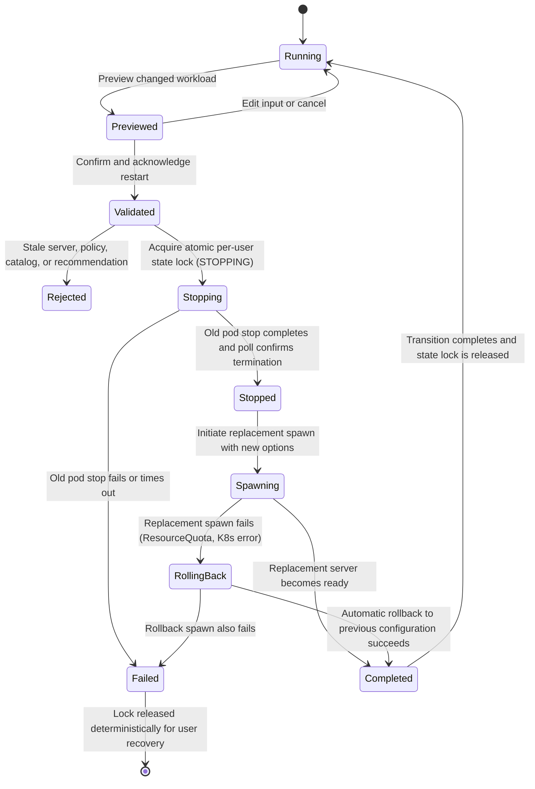

# Intent-aware Re-provisioning

## Scope

This design lets an authenticated user describe a changed workload after their
default notebook server is running. The Hub recomputes a recommendation,
previews the current and proposed configurations, requires an explicit restart
acknowledgement, stops the old pod, and starts a replacement pod with the new
allowlisted resources and image.

The operation is **re-provisioning**, not migration:

- there is no live migration;
- kernel variables, active computations, terminals, processes, and other
  in-memory state are not retained;
- files must be saved under `/home/jovyan` before confirmation; and
- the same per-user PersistentVolumeClaim (PVC) is mounted into the replacement
  pod, so saved home-directory files survive the pod replacement.

The implementation targets the repository's disposable local demo. It does not
claim transparent resizing, zero downtime, or production-grade recovery.

## Deployment composition

`helm/reprovision-values.yaml` is applied after `helm/proposed-values.yaml`.
The overlay intentionally reuses the proposed path's trusted objects:

- the server-side preview builder recomputes the recommendation; a compatibility
  adapter uses the original inline `recommend_workload` contract when the
  pluggable `build_preview_payload` function is not present;
- `context_options_from_form` validates accept/override decisions and allowlists;
- `context_pre_spawn_hook` applies the resource and image policy; and
- `PolicyValidator` remains the backend-neutral trust boundary.

The proposed installer applies both values files. Keeping Task D in an overlay
makes the stop/start transaction and persistence change explicit while avoiding
a second copy of recommendation or resource rules.

The chart version used by the repository includes JupyterHub 5.2.1 and
KubeSpawner 7. JupyterHub's supported server lifecycle exposes separate stop and
start operations, while Zero to JupyterHub dynamic storage reuses a pre-existing
per-user PVC on later starts. See the official
[JupyterHub server API](https://jupyterhub.readthedocs.io/en/5.2.1/reference/rest-api.html)
and [Zero to JupyterHub storage guide](https://z2jh.jupyter.org/en/stable/jupyterhub/customizing/user-storage.html).

## User flow

1. Start a notebook through the normal recommendation-confirmation form.
2. Save notebooks and other files under `/home/jovyan`.
3. Open `/hub/reprovision` while the default server is running.
4. Enter the new intent, dataset estimate, and optional code context.
5. Select **Preview replacement**. No pod is changed at this point.
6. Review current versus proposed profile/image, reasons, and restart warnings.
7. Check the acknowledgement that kernel and terminal state will be lost.
8. Select **Stop old pod and create replacement**.
9. Follow the standard JupyterHub spawn-progress page to the replacement server.

## User flow

1. Start a notebook through the normal recommendation-confirmation form.
2. Save notebooks and other files under `/home/jovyan`.
3. Open `/hub/reprovision` while the default server is running.
4. Enter the new intent, dataset estimate, and optional code context.
5. Select **Preview replacement**. No pod is changed at this point.
6. Review current versus proposed profile/image, reasons, and restart warnings.
7. Check the acknowledgement that kernel and terminal state will be lost.
8. Select **Stop old pod and create replacement**.
9. Follow the standard JupyterHub spawn-progress page to the replacement server.

The Task D handler accepts `action: "accept"` for confirmed re-provisioning. Manual override (`action: "override"`) is intentionally disabled during re-provisioning to prevent unpreviewed profile/image forgery; only administrator-approved, server-recomputed recommendations matching the previewed contract are applied.

## State machine

Preview is read-only. The irreversible boundary is confirmation: after trusted
server-side recomputation and validation, the current pod is stopped. If the
replacement spawn fails, an automatic **rollback** is initiated to respawn the
user's server using their previous known-good resource profile and image. If
rollback also fails, the state transitions to `FAILED`, audit events are logged,
and locks are released so the user can re-trigger spawn from `/hub/home`.

## Audit events

Task D adds privacy-minimized `reprovision_audit=` events:

- `reprovision_started` records event/generation IDs, previous and proposed
  profile/image IDs, and the explicit persistence boundary;
- `reprovision_failed` records failure stage (`stop` or `spawn`) and error details if the transition fails;
- `reprovision_rollback_started`, `reprovision_rolled_back`, and `reprovision_rollback_failed`
  track automatic rollback progress on replacement spawn failures;
- the existing `recommendation_decision` event is emitted by the reused
  pre-spawn hook; and
- `reprovision_completed` records the replacement decision after spawn returns.

Backend errors and failed operations are logged without raw intent or code.
The demo still has no durable audit sink; the retention and duplicate-delivery
limitations in the recommendation preview design continue to apply.

## Failure behavior

| Failure point | Old pod | PVC | Result |
| --- | --- | --- | --- |
| Invalid input, acknowledgement, allowlist, or stale preview | Running | Attached | Reject before mutation |
| Concurrent transition | Running or already transitioning | Unchanged | Return conflict (HTTP 409) |
| Old pod stop fails or times out | Not intentionally replaced | Retained | Task fails, state lock released, `reprovision_failed` logged; user guided to `/hub/home` |
| Replacement scheduling, quota, or image pull fails | Stopped | Retained | Triggers automatic rollback to previous profile/image. If rollback succeeds, server is restored with previous spec. If rollback fails, state lock released for user retry from `/hub/home`. |
| Hub restarts during the process | Indeterminate pod lifecycle | Retained by Kubernetes | Pod state inspected from cluster; running pod adopted or unready spawner cleared for safe retry |

## Validation

Local tests cover:

- dynamic persistent storage and handler registration;
- current/proposed preview and explicit limitation fields;
- acknowledgement, current-event, recommendation, policy, and catalog checks;
- privacy-minimized transition options;
- full stop-before-start ordering;
- replacement environment/annotation metadata; and
- UI acknowledgement controls.

Helm rendering validates the merged proposed and re-provision overlays. No
cluster-mutating re-provision experiment was run as part of Task D, so all
behavior beyond local tests and template validation remains a prototype claim,
not observed cluster evidence.
