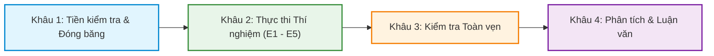

# Cẩm Nang Chạy Thực Nghiệm Protocol-v5 (Protocol-v5 Experiment Runbook)

Tài liệu này hướng dẫn toàn diện quy trình 4 khâu thực thi thực nghiệm của đề tài **Intent-Spawner Protocol-v5** từ kiểm tra tiền điều kiện, chạy thí nghiệm (E1 $\rightarrow$ E5), kiểm tra toàn vẹn dữ liệu, đến chạy engine tổng hợp luận văn và kiểm định các giả thuyết nghiên cứu (H1 $\rightarrow$ H8).

---

## 🗺️ Tổng Quan Quy Trình 4 Khâu



* **Thư mục mã nguồn:** `evaluation_v5/` (chứa source code Python của các runner, schema, validator).
* **Thư mục kết quả:** `results_v5/protocol-v5.0.0/` (chứa toàn bộ artifact thô, báo cáo markdown, metrics và checksum).

---

## 🔹 KHÂU 1: Tiền Kiểm Tra, Cô Lập Dữ Liệu & Đóng Băng Cấu Hình
> **Mục đích:** Xác minh môi trường phần cứng/Kubernetes, chống ô nhiễm dữ liệu (*data contamination*) và đóng băng cấu hình của các hệ thống P1, P2 để làm mốc đối chứng khoa học.

### 1.1 Kiểm tra ranh giới cô lập dữ liệu (Data Isolation Check)
Đảm bảo tập dữ liệu thử nghiệm độc lập không bị lộ cho code tuning:
```bash
make v5-isolation-check
# hoặc chạy trực tiếp:
PYTHONPATH=. .venv/bin/python -m pytest -q tests/test_evaluation_v5_isolation.py
```

### 1.2 Kiểm tra hạ tầng Kubernetes & Tài nguyên (cho E4)
Kiểm tra kết nối cụm, quyền namespace và công cụ CLI (kubectl, helm):
```bash
make v5-e4-preflight
# hoặc chạy trực tiếp:
PYTHONPATH=. .venv/bin/python -m evaluation_v5.resource preflight --target all
```

### 1.3 Tạo gói đóng băng cấu hình (Production Freeze Manifest)
Tạo snapshot bất biến (*immutable freeze*) ghi nhận mã nguồn, commit hash, cấu hình mô hình và catalog để dùng cho toàn bộ các thí nghiệm:
```bash
PYTHONPATH=. .venv/bin/python -m evaluation_v5.freeze \
  --output-dir results_v5/protocol-v5.0.0/freezes/freeze-$(date +%Y%m%d)
```
📁 **Đầu ra:** `results_v5/protocol-v5.0.0/freezes/<freeze-id>/freeze-manifest.json`

---

## 🔹 KHÂU 2: Thực Thi Thí Nghiệm (Experiment Execution E1 $\rightarrow$ E5)
> **Mục đích:** Chạy từng bài thí nghiệm thực tế, thu thập số liệu quan sát thô và xuất kết quả vào `results_v5/protocol-v5.0.0/E<n>/`.

### 1. Thí nghiệm E1 — Đo chất lượng gợi ý (P1 vs P2 Recommendation Quality)
So sánh bộ gợi ý dựa trên luật (P1) với bộ gợi ý intent ngữ nghĩa đề xuất (P2) về Top-1, Hit@K, MRR, nDCG:
```bash
PYTHONPATH=. .venv/bin/python -m evaluation_v5.offline.runner \
  --split development \
  --systems P1,P2 \
  --repeats 5 \
  --seed 20260824 \
  --result-dir results_v5/protocol-v5.0.0/E1/run-e1-dev
```
📁 **Đầu ra:** `results_v5/protocol-v5.0.0/E1/run-e1-dev/`

### 2. Thí nghiệm E2 — Độ bền vững trước biến thể ngôn ngữ tự nhiên (NL Robustness)
Đo lường độ ổn định của Intent Extractor trước các câu paraphrase, câu sai chính tả, câu văn không trang trọng và tiếng Việt:
```bash
PYTHONPATH=. .venv/bin/python -m evaluation_v5.robustness \
  --input-corpus benchmarks_v5/v5-development.yaml \
  --result-dir results_v5/protocol-v5.0.0/E2/run-e2-dev
```
📁 **Đầu ra:** `results_v5/protocol-v5.0.0/E2/run-e2-dev/`

### 3. Thí nghiệm E3 — Nghiên cứu người dùng (B0 vs P2 Usability Study)
Đo đạc thời gian thao tác, số lỗi và mức độ hài lòng giữa chọn profile thủ công (B0) và Intent-Spawner (P2):
* **Chạy Smoke Test (Kiểm tra pipeline phân tích số liệu giả lập):**
  ```bash
  make v5-user-study-smoke
  # hoặc chạy trực tiếp:
  PYTHONPATH=. .venv/bin/python -m evaluation_v5.user_study.smoke
  ```
* **Chạy phân tích phiên thử nghiệm người dùng thật:**
  ```bash
  PYTHONPATH=. .venv/bin/python -m evaluation_v5.user_study.runner \
    --assignment-dir benchmarks_v5/protocol-v5-e3-assignment-target-36 \
    --output-dir results_v5/protocol-v5.0.0/E3/run-e3-study
  ```
📁 **Đầu ra:** `results_v5/protocol-v5.0.0/E3/run-e3-study/`

### 4. Thí nghiệm E4 — Hiệu quả tài nguyên CPU/RAM trên Kubernetes
Đo đạc mức tiêu thụ tài nguyên thực tế, OOM, scheduling delay và dung lượng node:
* **Chế độ Dry-run (Mô phỏng không cần cluster):**
  ```bash
  make v5-resource-dry-run
  make v5-resource-efficiency-dry-run
  ```
* **Chế độ Chạy Thật trên Kubernetes (Yêu cầu OrbStack / K8s / Kind đang bật):**
  ```bash
  # Bước 4.1: Đo đạc phong bì tài nguyên (Envelope Calibration)
  PYTHONPATH=. .venv/bin/python -m evaluation_v5.resource execute --target envelope
  
  # Bước 4.2: Chạy thực nghiệm hiệu quả cấp phát tài nguyên (Efficiency Runner)
  PYTHONPATH=. .venv/bin/python -m evaluation_v5.resource.efficiency_runner execute
  ```
📁 **Đầu ra:** `results_v5/protocol-v5.0.0/E4/<run-id>/`

### 5. Thí nghiệm E5 — Quy mô lưu trữ Image & Kiểm tra thực thi trong Container
* **Nhánh A: Đo quy mô lưu trữ Image Catalog (Storage Scalability):**
  ```bash
  PYTHONPATH=. .venv/bin/python -m evaluation_v5.image_storage \
    --experiment storage \
    --output-dir results_v5/protocol-v5.0.0/E5/run-storage
  ```
* **Nhánh B: Kiểm tra Functional In-Container Probe (dựa trên kết quả E1):**
  ```bash
  PYTHONPATH=. .venv/bin/python -m evaluation_v5.image_storage \
    --experiment functional \
    --recommendation-run results_v5/protocol-v5.0.0/E1/run-e1-dev \
    --output-dir results_v5/protocol-v5.0.0/E5/run-functional
  ```
📁 **Đầu ra:** `results_v5/protocol-v5.0.0/E5/`

---

## 🔹 KHÂU 3: Kiểm Tra Tính Toàn Vẹn Kết Quả (Evidence Validation)
> **Mục đích:** Đối chiếu mã băm SHA-256, schema và provenance để đảm bảo các file kết quả vừa sinh không bị chỉnh sửa thủ công hay suy hao.

```bash
# 1. Validate kết quả E1:
PYTHONPATH=. .venv/bin/python -m evaluation_v5.offline.validate_evidence results_v5/protocol-v5.0.0/E1/run-e1-dev

# 2. Validate manifest tài nguyên E4:
make v5-resource-validate
make v5-resource-efficiency-validate

# 3. Validate kết quả E5:
PYTHONPATH=. .venv/bin/python -m evaluation_v5.image_storage.validate_evidence results_v5/protocol-v5.0.0/E5/run-storage
PYTHONPATH=. .venv/bin/python -m evaluation_v5.image_storage.validate_evidence results_v5/protocol-v5.0.0/E5/run-functional

# 4. Kiểm tra mã băm SHA-256 toàn bộ các artifact thô:
make validate-raw-integrity
```

---

## 🔹 KHÂU 4: Tổng Hợp Luận Văn & Kiểm Định Giả Thuyết (Research Analysis Engine)
> **Mục đích:** Engine tự động quét toàn bộ thư mục `results_v5/`, đối chiếu với Claim Registry (`benchmarks_v5/protocol-v5-claim-registry-v1.2.yaml`), tính toán $p$-value, effect size (Cohen's $d$, Cliff's $\delta$), điều chỉnh bội Holm-Bonferroni và xuất quyết định chính thức cho các giả thuyết nghiên cứu **H1 $\rightarrow$ H8** (RQ1 $\rightarrow$ RQ6).

### 4.1 Khám phá các gói kết quả hợp lệ (Discover)
```bash
PYTHONPATH=. .venv/bin/python -m evaluation_v5.analysis.research_analysis discover \
  --results-root results_v5/protocol-v5.0.0 \
  --freeze results_v5/protocol-v5.0.0/freezes/<freeze-id>/freeze-manifest.json
```

### 4.2 Chạy phân tích tổng thể và xuất báo cáo Luận văn (Analyze)
```bash
PYTHONPATH=. .venv/bin/python -m evaluation_v5.analysis.research_analysis analyze \
  --results-root results_v5/protocol-v5.0.0 \
  --freeze results_v5/protocol-v5.0.0/freezes/<freeze-id>/freeze-manifest.json \
  --output-root results_v5/protocol-v5.0.0/analysis \
  --run-id thesis-final-analysis
```

### 4.3 Xác thực tính hợp lệ của gói báo cáo (Validate Analysis Package)
```bash
PYTHONPATH=. .venv/bin/python -m evaluation_v5.analysis.research_analysis validate \
  results_v5/protocol-v5.0.0/analysis/thesis-final-analysis
```

📁 **Đầu ra cuối cùng:** `results_v5/protocol-v5.0.0/analysis/thesis-final-analysis/`
* `report/RESEARCH_ANALYSIS_REPORT.md`: Báo cáo chi tiết kết luận từng giả thuyết (H1 $\rightarrow$ H8).
* `derived/evaluated-claims.json`: Kết quả kiểm định thống kê máy đọc ($p$-value, effect size, verdict `SUPPORTED`/`NOT_SUPPORTED`/`NOT_EXECUTED`).
* `derived/evidence-inventory.json`: Danh mục nguồn gốc các bằng chứng thực nghiệm đã sử dụng.

---

## 📋 Bảng Tra Cứu Nhanh (Cheat Sheet)

| Tác vụ | Lệnh thực thi | Đầu ra chính |
| :--- | :--- | :--- |
| **Kiểm thử mã nguồn toàn diện** | `pytest` | Kết quả pass/fail kiểm thử code |
| **Kiểm tra ranh giới cô lập** | `make v5-isolation-check` | Pass/fail data isolation |
| **Preflight Kubernetes (E4)** | `make v5-e4-preflight` | Trạng thái sẵn sàng của Cluster |
| **Đóng băng cấu hình (Khâu 1)** | `python -m evaluation_v5.freeze --output-dir ...` | `freeze-manifest.json` |
| **Chạy E1 (Recommender Quality)** | `python -m evaluation_v5.offline.runner ...` | `results_v5/protocol-v5.0.0/E1/` |
| **Chạy E2 (Robustness)** | `python -m evaluation_v5.robustness ...` | `results_v5/protocol-v5.0.0/E2/` |
| **Chạy E3 (User Study Smoke)** | `make v5-user-study-smoke` | Log giả lập thao tác người dùng |
| **Chạy E4 (Kubernetes Resource)** | `python -m evaluation_v5.resource execute ...` | `results_v5/protocol-v5.0.0/E4/` |
| **Chạy E5 (Image Storage)** | `python -m evaluation_v5.image_storage ...` | `results_v5/protocol-v5.0.0/E5/` |
| **Validate kết quả (Khâu 3)** | `python -m evaluation_v5.*.validate_evidence ...` | Pass/fail SHA256 & Schema |
| **Tổng hợp Luận văn (Khâu 4)** | `python -m evaluation_v5.analysis.research_analysis analyze ...` | `results_v5/protocol-v5.0.0/analysis/` |
