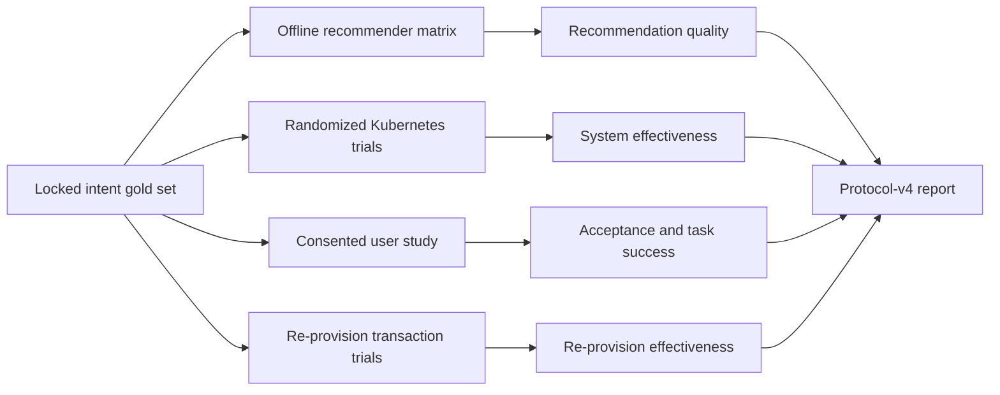

# Evaluation Protocol v4: Recommender Quality and System Effectiveness

> Protocol record: this document preserves the original broad evidence-stream
> design, including user and re-provisioning streams that were not all executed.
> For the completed four-method RQ1-RQ5 study and current claim status, use
> `PROTOCOL_V4_REVISED_EVALUATION_REPORT.md`. Do not interpret future-tense
> instructions below as the current execution status.

## Status and claim boundary

Protocol v4 is the forward-looking evaluation for the current system. It adds
multi-backend recommendation, notebook-image selection, backend fallback,
policy enforcement, user confirmation/override, and intent-aware
re-provisioning to the older resource-profile experiments.

The protocol and executable analysis are implemented. No new Kubernetes trial
or real-user study is claimed merely because the code exists. A result is
claimable only when its corresponding append-only input stream contains
`evidence_class: observed` records with the required supporting evidence. The
analyzer keeps `observed`, `simulated`, and `replay` strata separate.

Protocol v4 does not rewrite or merge the preserved v2 corpus or the frozen v3
resource-envelope protocol. Those remain independent evidence classes.

## Research questions

| ID | Question | Primary endpoint |
| --- | --- | --- |
| RQ1 | How accurately does each recommender select a safe, efficient resource profile? | acceptable-profile accuracy and underprovisioning rate |
| RQ2 | How accurately does each recommender select an administrator-approved image with the required capabilities? | acceptable-image accuracy and capability coverage |
| RQ3 | Does the applied recommendation improve cluster effectiveness versus under- and overprovisioned static baselines? | workload success, OOM rate, Pending-failure rate, CPU/memory request utilization |
| RQ4 | Do users accept the recommendation without override, and can they complete the task? | decided-session acceptance rate and task-success rate |
| RQ5 | Can an accepted workload change be applied by re-provisioning without losing persisted files? | strict re-provision success rate |
| RQ6 | Do network recommenders remain usable under timeout or invalid-output failures? | fallback rate, error rate, latency, and post-fallback joint accuracy |

The primary endpoints are fixed before the confirmatory test and cluster runs.
Other outputs are secondary or diagnostic.

## Pre-specified hypotheses

- H1: a full-context recommender has higher joint acceptable accuracy than
  `static_small`, `static_large`, and `rule_based_intent_only` on the locked
  test split.
- H2: full-context methods have lower underprovisioning than `static_small` and
  lower overprovisioning than `static_large`.
- H3: methods that consume code context have higher image-capability coverage
  than static-image baselines.
- H4: on repeated cluster trials, the selected confirmatory recommender has a
  lower OOM/Pending-failure composite than `static_small` while using requests
  more efficiently than `static_large`.
- H5: observed re-provisioning succeeds only when the replacement becomes
  ready, the PVC sentinel survives, the bounded workload resumes, and no
  OOM/Pending failure occurs.

User acceptance is estimated with an interval and compared between randomized
conditions. No post-hoc universal acceptance threshold is introduced after
seeing the data.

## Four independent evidence streams



Offline prediction output cannot support Kubernetes, user-behavior, or
re-provisioning claims. Similarly, simulated system records are useful for
testing the analyzer but cannot support effectiveness claims.

## Gold dataset

The frozen manifest is `benchmarks/intent-gold-v4.yaml`.

### Composition

- 60 synthetic intent samples;
- 24 workload families;
- 12 development samples from 4 families;
- 48 confirmatory test samples from 20 families;
- English canonical/paraphrase and Vietnamese variants;
- 12 strata covering light, tabular, numerical, CPU-bound, machine learning,
  deep learning, threshold, conflicting-signal, hidden-demand, noisy-context,
  context-recovery, and policy-constrained cases; and
- all four administrator catalog images.

Paraphrases and translations within a family represent the same operational
workload. Families never cross development/test splits. The workload family,
not the text variant, is the resampling unit.

### Gold-label axes

Each item contains independent labels for:

1. preferred resource profile;
2. operationally acceptable resource profiles;
3. preferred and acceptable image IDs;
4. required image capabilities; and
5. allowed profiles and GPU policy.

Resource labels are operational gold labels: they come from controlled
workload specifications, frozen resource-envelope bands, or an explicit
administrator policy. They are not inferred from the recommender being tested.
Image labels come from required capabilities and the frozen administrator
catalog. Every label cites one or more evidence IDs and has a locked
adjudication status.

The hidden-demand and noisy-size families are intentional robustness cases.
They may be impossible to solve from the declared input alone; they must remain
in the denominator and must not be relabeled after observing predictions.

### Independent review before thesis freeze

Before the final confirmatory run, two reviewers should independently check:

- whether the intent and context describe the claimed workload family;
- whether every acceptable profile is justified by the controlled envelope or
  policy;
- whether every acceptable image covers the declared capabilities; and
- whether Vietnamese and English variants preserve the same operational
  meaning.

Disagreements are adjudicated without inspecting recommender outputs. If a
label changes, increment `dataset_id` and `label_policy_version`, record the
change, and rerun all methods. Do not silently modify a frozen test set.

## Compared recommenders

| Method | Inputs | Purpose |
| --- | --- | --- |
| `static_small` | none | underprovisioning baseline |
| `static_large` | none | defensive overprovisioning baseline |
| `rule_based_intent_only` | intent only | input ablation |
| `rule_based_context` | intent, size, code hints | deterministic proposed baseline |
| `external_llm` | full context | hosted OpenAI-compatible backend |
| `self_hosted_llm` | full context | locally managed OpenAI-compatible backend |

The LLM methods are optional at runtime because they require configured
endpoints. A missing endpoint is not replaced with invented output. Network
results record requested/effective backend, backend version, model ID,
attempts, latency, fallback use, and a sanitized error category.

The administrator policy remains authoritative. `gpu_or_large` is normalized
to `large` in this no-GPU environment. A policy-incompatible raw result is
recorded as a policy violation even when the applied profile is safely mapped
to an allowed value.

## Stage A: development and freezing

Use only the development split to debug prompts, thresholds, schemas, timeout
budgets, or model configuration. Record:

- repository commit and dirty-tree status;
- dataset ID and canonical SHA-256;
- backend and model versions;
- image catalog and policy versions;
- seeds, repeat counts, and run manifest; and
- any change made before freezing.

After freezing, do not inspect test outputs while changing prompts or rules. A
change after test inspection creates a new exploratory protocol version.

## Stage B: confirmatory offline benchmark

Run every frozen method over the complete test split. Five repeats are
recommended when LLM backends are included so output stability and fallback
behavior are observable. Deterministic methods may also be repeated to keep a
balanced paired matrix; inference still clusters by workload family.

Example without network calls:

```bash
.venv/bin/python -m evaluation_v4.run_recommenders \
  --split test \
  --repeats 1 \
  --recommenders static_small,static_large,rule_based_intent_only,rule_based_context \
  --output experiments/raw/v4-offline-YYYYMMDD
```

Example with all configured backends:

```bash
.venv/bin/python -m evaluation_v4.run_recommenders \
  --split test \
  --repeats 5 \
  --recommenders static_small,static_large,rule_based_intent_only,rule_based_context,external_llm,self_hosted_llm \
  --output experiments/raw/v4-all-backends-YYYYMMDD
```

The output directory must not exist. Predictions are append-only JSONL and a
run manifest records provenance. Free-form backend errors are not persisted.

## Recommendation-quality metrics

Let `g` be the preferred gold profile, `A` the acceptable profile set, `p` the
applied predicted profile, and `rank(small, medium, large) = (0, 1, 2)`.

- exact profile accuracy: `mean(p = g)`;
- acceptable profile accuracy: `mean(p in A)`;
- ordinal profile error: `mean(|rank(p) - rank(g)|)` for available outputs;
- underprovisioning rate: `mean(rank(p) < min rank(A))`;
- overprovisioning rate: `mean(rank(p) > max rank(A))`;
- exact/acceptable image accuracy, defined analogously;
- capability coverage: required capabilities are a subset of the predicted
  image capabilities;
- joint acceptable accuracy: profile and image are acceptable, policy is
  satisfied, and no backend error occurs;
- coverage, error rate, fallback rate, median latency, and p95 latency; and
- family robustness: dominant output rate and whether all variants are jointly
  acceptable.

An unavailable output is incorrect for full-denominator accuracy and is
reported separately through coverage/error rate. Missing latency is not
imputed.

## Stage C: randomized Kubernetes effectiveness experiment

### Confirmatory methods

Use four frozen methods:

1. `static_small`;
2. `static_large`;
3. `rule_based_context`; and
4. at most one LLM backend selected using development data only.

If no LLM backend passes the development reliability gate, omit it and document
the reason. Do not select the best LLM on the test set.

### Matrix and repetition

The gold manifest maps eight test families to the eight frozen, bounded v3
hold-out workloads. Text variants and semantic-only families are not run as
separate system workloads. They either share operational demand or do not yet
have an independently calibrated executable analogue. This prevents synthetic
intent diversity from being misrepresented as additional system workloads.

Recommended matrix: 8 executable families × 4 methods × 10 repeats = 320
trials. If capacity makes this infeasible, perform an a-priori
power/simulation analysis, reduce the matrix before observing outcomes, and
report the precision loss.

Randomize trial order within repeat blocks. Use the same workload seed for all
methods in a paired block. Pre-pull and verify all frozen images in an excluded
warm-up phase, then run the confirmatory matrix with a warm cache. If cold-image
startup is studied, execute it as a separate secondary block; image caching
must not be confounded with the method.

Generate the frozen paired/randomized plan without creating pods:

```bash
.venv/bin/python -m evaluation_v4.plan_system \
  --methods static_small,static_large,rule_based_context,self_hosted_llm \
  --repeats 10 \
  --seed 20260808 \
  --output experiments/raw/v4-system-plan-YYYYMMDD
```

The generator assigns a shared seed to all methods in a family/repeat block,
shuffles within blocks, and marks every confirmatory trial `warm_required`.
The executor must verify that precondition. The plan is an execution contract,
not observed evidence.

### Controls

- disposable cluster and namespace `z2jh-context-demo` only;
- frozen Git commit, Helm values, image digests, catalog, and policy;
- fixed node count/capacity and autoscaling state;
- fixed quota and competing-load condition;
- bounded workload duration and memory targets;
- resource metrics sampled over the same workload window;
- cgroup or metrics-source identity recorded per trial;
- cleanup verified after every trial; and
- raw pod status, events, requests, limits, and metric evidence retained before
  aggregation.

Run no load-generating or pod-creating command on a shared or production
cluster.

### System metrics

For each trial:

- CPU request utilization = time-window mean CPU usage / CPU request;
- memory request utilization = time-window mean memory usage / memory request;
- peak memory pressure = peak memory usage / memory request;
- OOM rate = OOM-killed trials / attempted trials;
- Pending-failure rate = trials that exceed the pre-specified scheduling
  deadline or remain unschedulable / attempted trials;
- image-pull failure rate;
- pod-ready and workload-success rates;
- Pending duration, time to ready, and workload duration; and
- applied profile/image acceptability against the locked gold set.

Any transient Kubernetes `Pending` phase before successful scheduling is not a
Pending failure. The deadline and failure reasons must be fixed in the run
configuration. Mean usage is a time-window statistic; a peak must never be
silently substituted for it. Metric availability is reported explicitly.

## Stage D: user acceptance study

Acceptance requires observed, consented interaction data. Synthetic decisions
must be marked `simulated` and are excluded from observed claims.

Use a randomized design with assignment blocked by experience level. A
practical minimum plan is 36 participants, six bounded synthetic tasks per
participant, and balanced allocation across the confirmatory recommender
conditions. Tasks are sampled across strata without repeating a task for the
same participant. If a within-participant crossover is used instead, rotate
method order with a Latin square and model participant/task dependence. Do not
expose the gold label. The final participant count should be justified by an
a-priori precision or power calculation using pilot data; 36 is a planning
target, not a guarantee of adequate power for every effect size.

Primary acceptance denominator:

`accept / (accept + override)`

Cancellation is reported separately and also included in
`accept / all exposures`. Report task success and decision time so a high
acceptance rate cannot mask unusable recommendations.

Store only a study-specific random `participant_block_id`. Keep the identity
mapping, if any, outside the research artifact and destroy it according to the
approved retention plan. Record consent version; do not store raw notebook
content, real datasets, usernames, or free-form interaction transcripts.

## Stage E: re-provisioning effectiveness

Each trial begins with a ready server and a PVC sentinel file. The new intent
must require a different frozen profile and/or image. Record the stop/start
transaction and bounded post-start probe.

Strict success requires all of the following:

1. outcome is `completed`;
2. replacement pod becomes ready;
3. PVC sentinel is readable and unchanged;
4. bounded workload resumes successfully;
5. no Pending failure; and
6. no OOM kill.

Also report replacement-ready, PVC-continuity, workload-resume, rollback
attempt/success, and downtime separately. A successful rollback is recovery,
not successful re-provisioning.

Recommended scenario blocks include Small→Large, Large→Small,
minimal→data-science, data-science→deep-learning, quota rejection, image-pull
failure, and rollback success/failure. Failure injection must remain bounded
and confined to the demo namespace.

## Statistical analysis

### Recommendation benchmark

- point estimates use the locked test set;
- 95% percentile confidence intervals resample workload families;
- pairwise joint-accuracy comparisons use exact McNemar tests on common paired
  sample/repeat keys; and
- Holm correction controls family-wise error across pairwise tests.

Report effect sizes and intervals even when a p-value is not significant.
Development results are diagnostic and must not be pooled with test results.

### System experiment

Use paired workload/repeat blocks. For binary endpoints, use paired exact tests
or a mixed-effects/logistic model with workload family as a grouping factor if
the final sample supports it. For continuous utilization/time endpoints,
report paired differences with family-clustered bootstrap intervals. Include
method, workload stratum, cache block, and repeat block in any confirmatory
model specified before analysis.

OOM and Pending are separate primary safety endpoints; a composite may be
secondary. Do not claim equivalence from a non-significant difference. If a
non-inferiority claim is desired, specify the margin before data collection.

### User study

Report participant-block counts, exposures, decided sessions, acceptance with
a participant-block bootstrap interval, override/cancel rates, task success,
and decision-time median. Use participant-aware inference when comparing
methods; exact paired comparisons are emitted only when the same participant
and task appear under both conditions. Do not treat multiple sessions from one
participant as independent.

## Missingness, exclusions, and failures

- Preserve every attempted trial, including orchestration failures.
- Pre-specify exclusions: invalid setup before resource creation, corrupted raw
  evidence, or safety abort. Outcome failures after a pod or transaction starts
  remain in the denominator.
- Never replace missing usage measurements with zero.
- Report metric availability by method and evidence class.
- Report fallback outputs under both the requested and effective backend.
- Keep timeout, invalid-output, policy violation, image pull, scheduling, OOM,
  workload, and cleanup failures distinct.
- Preserve raw evidence before generating summaries and hash all supplied
  analysis inputs.

## Analysis command and outputs

```bash
.venv/bin/python -m evaluation_v4.analyze \
  --predictions experiments/raw/v4-offline-YYYYMMDD/predictions.jsonl \
  --system-trials experiments/raw/v4-system-YYYYMMDD/system-trials.jsonl \
  --user-events experiments/raw/v4-user-study-YYYYMMDD/user-events.jsonl \
  --reprovision-trials experiments/raw/v4-reprovision-YYYYMMDD/reprovision-trials.jsonl \
  --bootstrap-replicates 5000 \
  --out results/v4-analysis-YYYYMMDD
```

The analyzer writes recommendation summaries and breakdowns, family robustness,
McNemar-Holm comparisons, system effectiveness, user acceptance,
re-provisioning effectiveness, a machine-readable analysis object, an input
hash manifest, and a report with explicit claim gates.

See `EVIDENCE_COLLECTION_V4.md` for record contracts and collection rules.

## Thesis claim language

Allowed when the corresponding observed evidence exists:

- “On the locked synthetic intent test set…”
- “In repeated trials on the pinned disposable cluster…”
- “Among consented participants in the bounded study…”
- “In the controlled re-provisioning transaction matrix…”

Not allowed from this protocol alone:

- production-wide utilization or reliability claims;
- real-world OOM reduction without observed comparable trials;
- universal user preference;
- transparent migration or kernel-state preservation;
- GPU scheduling effectiveness in a cluster with no GPU; or
- causal claims when randomization, pairing, or evidence gates were not met.
