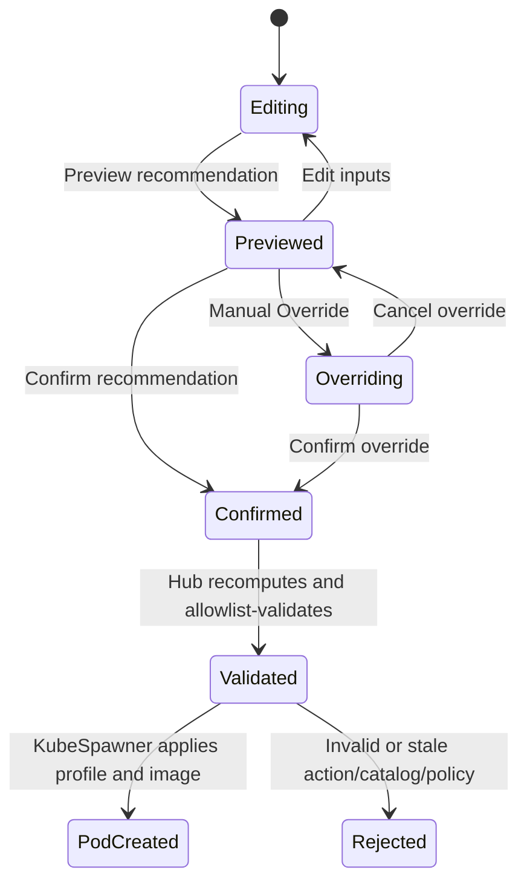

# Resource-and-Image Recommendation Preview Design

## Scope and decision boundary

The proposed interactive path recommends two independent deployment choices:

1. a resource profile (`small`, `medium`, `large`, or the advisory
   `gpu_or_large` signal mapped to `large` in this CPU-only demo); and
2. a notebook image ID from the administrator-owned catalog.

It never builds an image and never accepts a registry reference from a user.
`helm/proposed-values.yaml` is the deployed policy source, while
`recommender/image-catalog.yaml` is the matching standalone recommender
catalog. Configuration tests require those catalogs to remain identical.

## Catalog and intent mapping

Every catalog entry has a stable ID, display name, immutable digest reference,
description, capability list, match terms, and integer priority. The default
image handles inputs with no specialized software signal. Higher-priority
specific matches win deterministically.

| Intent or code signal | Recommended image | Main capability |
| --- | --- | --- |
| No specialized term | `minimal-python` | Python and JupyterLab |
| pandas, CSV/Parquet, SciPy, visualization, scikit-learn or general training | `scipy-data-science` | Scientific Python and classical ML |
| PyTorch, CUDA, generic GPU/deep-learning terms | `pytorch-deep-learning` | PyTorch user-space stack |
| TensorFlow or Keras | `tensorflow-deep-learning` | TensorFlow user-space stack |

TensorFlow has higher priority than generic deep-learning terms. The two
deep-learning images contain CUDA user-space libraries, but this demo does not
request a GPU device. The resource explanation therefore retains the explicit
CPU-only `gpu_or_large` fallback warning.

Catalog references are pinned to multi-architecture manifest digests. An
administrator must validate architecture coverage, registry availability,
vulnerability status, package contents, and license policy before changing an
entry. Removing an entry prevents new selections but does not mutate already
running pods.

## Confirm-before-spawn state machine

The browser preview is a user-interface aid, not the security boundary. Any
input change invalidates the preview and disables both submit paths. The Hub
then recomputes the recommendation from the submitted intent and context,
ignores any client-side recommended values, validates override IDs against the
allowlists, and stores only the derived decision in `user_options`.

The ordinary JupyterHub submit control is hidden. A direct or forged form
submission still reaches server validation and is rejected unless it carries a
supported preview version and an `accept` or `override` action. This prevents
the previous automatic-spawn behavior in the supported UI; it is not an
anti-CSRF replacement, which remains JupyterHub's responsibility.

## KubeSpawner integration

After validation, `pre_spawn_hook`:

- applies CPU and memory guarantees/limits from `PROFILE_RESOURCES`;
- assigns `spawner.image` from the catalog reference associated with the
  applied image ID;
- rejects missing, stale, or non-allowlisted decisions;
- adds derived environment variables and allowlisted pod annotations; and
- emits one structured audit event before pod creation.

Raw intent and code context are used only during form parsing. They are not
returned in `user_options`, copied into the pod, included in annotations, or
written into the audit event.

## Audit event for evaluation

Hub logs contain a JSON object prefixed by `recommendation_audit=` with:

| Field | Meaning |
| --- | --- |
| `event`, `event_id` | Event type and random correlation ID |
| `action` | `accept` or `override` |
| `recommended_profile`, `applied_profile` | Resource decision before and after user action |
| `recommended_image_id`, `applied_image_id` | Image decision before and after user action |
| `profile_overridden`, `image_overridden` | Derived change flags |
| `score` | Explainable resource-rule score |
| `policy_version`, `catalog_version` | Configuration identity |

The pod receives the same event ID and decision labels, which permits a demo
operator to correlate the Hub event with the resulting pod without recording a
username. `Edit inputs` is intentionally not logged: it does not reach the
server and recording keystroke-level edits would violate the data-minimization
boundary.

The demo uses in-memory Hub state and ordinary container logs. A production or
real-user evaluation must ship structured logs to an access-controlled durable
sink, define retention/deletion, handle duplicate delivery by `event_id`, and
obtain the required consent or institutional review. The current repository
does not claim durable audit storage.

## Scalability assessment

The rule evaluation cost is linear in the number of catalog match terms and
input length. With four images and a few dozen terms it is negligible relative
to authentication, image pulling, scheduling, and container startup. The
algorithm is deterministic and stateless, so multiple Hub replicas can use the
same versioned configuration without shared recommender state.

The practical scaling constraint is image distribution, especially the large
deep-learning images. More choices reduce cache locality and can increase
registry bandwidth, node disk pressure, and cold-start latency. A production
deployment should keep the catalog small, measure image pull latency/cache-hit
rate, enable an appropriate image pre-puller only after capacity analysis, and
retire unused images. Catalog growth also makes simple keyword priority harder
to audit; overlapping capabilities should move to explicit rule groups and
configuration-lint tests before adding many entries.

Hub log volume grows once per confirmed spawn, not per edit or keystroke. It is
therefore proportional to spawn attempts and suitable for aggregation, subject
to normal backpressure, retention, and delivery controls in the log pipeline.

## Security and State Lifecycle Hardening

The recommendation and dynamic preview flows incorporate explicit web security and state lifecycle controls:

- **Context-Safe Inline Script Serialization**: Client-side catalog options and template parameters inserted into inline ``) from escaping the script tag context (XSS vector mitigation).
- **Single-Hub Scope & Fail-Closed Restart Invalidation**: Zero to JupyterHub operates under a single-Hub replica architecture (`hub.replicas: 1`). Preview state is maintained in-memory (`RECOMMENDATION_PREVIEWS`, `DYNAMIC_RESOURCE_PREVIEWS`). On Hub process restart or pod rollout, active preview tokens are safely invalidated fail-closed with explicit error messages (`ValueError("missing or invalid recommendation preview token (session may have expired or server restarted)")`), requiring the user to issue a fresh preview.
- **Token Lifecycle Guarantees**:
  - *One-time consumption*: Preview tokens are popped upon validation during spawn or re-provisioning.
  - *Replay resistance*: Re-submitting a consumed preview token immediately fails validation.
  - *TTL Expiration*: Previews expire after a bounded TTL (`RECOMMENDATION_PREVIEW_MAX_AGE_SECONDS = 3600`, `DYNAMIC_PREVIEW_TTL_SECONDS = 300`).
  - *Multi-tab isolation*: Each preview request receives a unique UUID token, allowing parallel browser tabs to maintain isolated preview states without collision.
  - *Memory bounds*: Active preview dictionaries strictly enforce upper size bounds (`MAX_ENTRIES = 1000`) by evicting oldest items based on `issued_at` timestamps.
- **Browser Matcher Regression Guard**: Dotted code signals such as `.fit(` use JavaScript's case-sensitive `String.startsWith()` method before substring matching. `tests/test_config_validation.py` asserts the rendered form contains `startsWith` and rejects the earlier Python-style `startswith` typo that broke preview execution.

## Suitability verdict and limitations

The design is suitable for this thesis prototype and a small controlled
deployment because it is explainable, deterministic, fail-closed, catalog
bounded, privacy-minimizing, and directly enforceable by KubeSpawner. It also
supports evaluation of acceptance and override behavior without treating the
recommendation as an irreversible automatic decision.

Production suitability is conditional. Before wider use, the deployment needs:

- a durable and access-controlled audit sink;
- catalog ownership, signing/provenance, vulnerability scanning, and retirement
  procedures;
- measured cold-start behavior for every cluster architecture and node pool;
- server-rendered or API-backed preview logic to remove browser/server rule
  duplication as policy complexity grows;
- accessibility and usability testing of Confirm/Edit/Override;
- concurrency/load tests for the Hub and log pipeline; and
- a real-user evaluation that reports acceptance, profile/image override rates,
  time-to-confirm, spawn success, cold-start latency, and outcome quality.

No new cluster or real-user measurements were run for this change. All claims
above are design analysis or local validation observations, not experimental
results.
